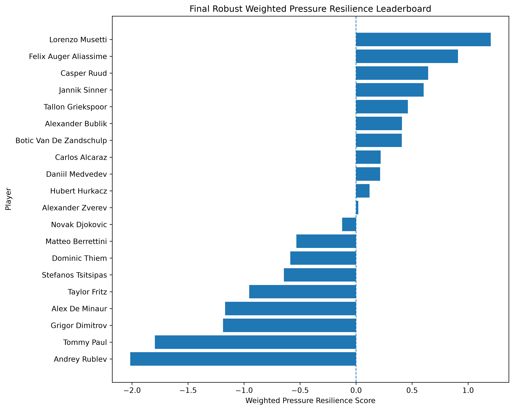
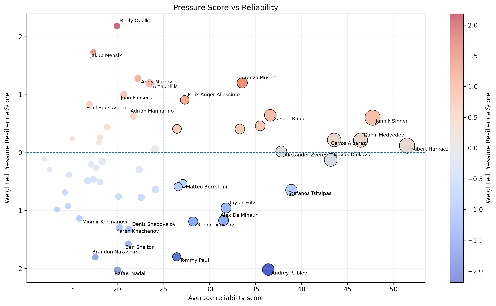
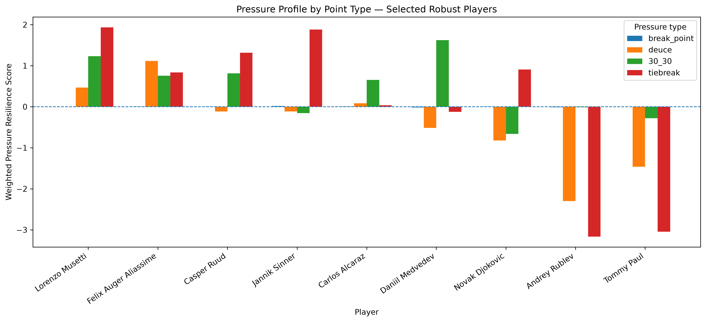
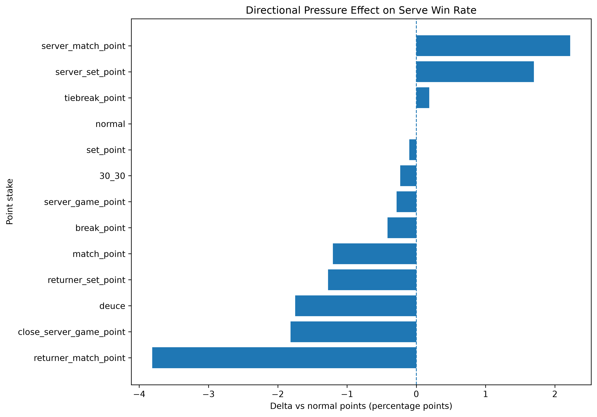
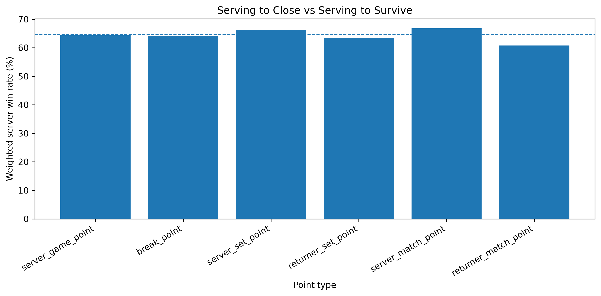
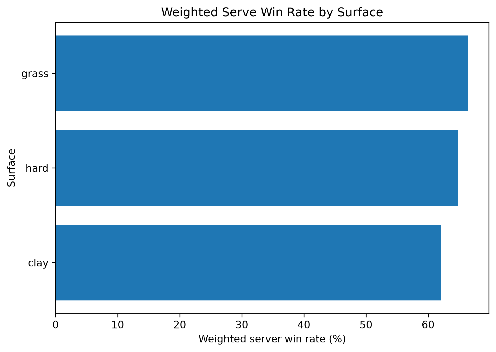
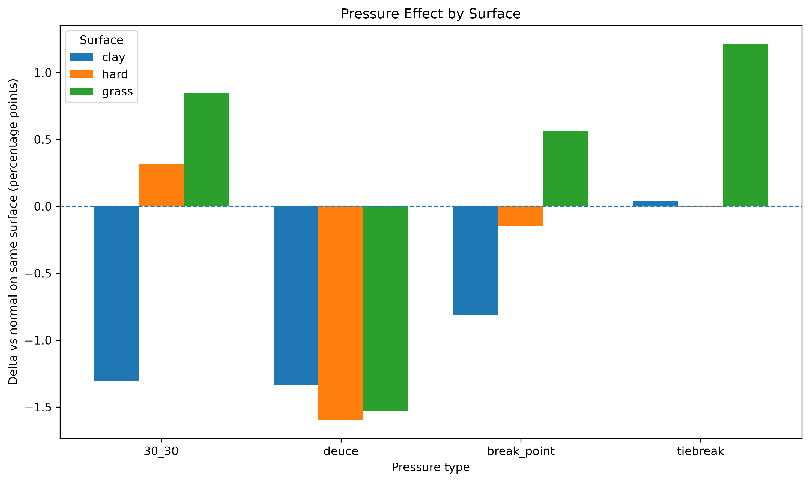

# ATP Pressure Resilience Analysis

A sports analytics project that builds a **tournament-weighted pressure resilience metric** for ATP players using point-by-point tennis data from 2020 to 2026.

The project does not try to simply predict match winners.  
Instead, it asks a more specific question:

> How does a player's serve performance change under pressure?

The result is a player-level framework that measures **Pressure Resilience** across break points, deuce points, 30-30 points, tiebreaks, set points, match points, tournament importance and surface context.

---

## Project overview

Tennis pressure is usually described with vague labels such as *clutch*, *mentally strong*, *choker*, or *big-match player*.

This project turns that idea into a data-driven analysis by comparing a player's serve performance in pressure situations against their own normal service points.

The final metric is called:

## Weighted Pressure Resilience Score

It is designed to answer:

> Does a player perform better or worse on serve when the point becomes more important?

The score is adjusted for:

- pressure type;
- tournament importance;
- round importance;
- effective sample size;
- statistical reliability;
- shrinkage;
- surface context.

---

## Dataset

The project uses ATP point-by-point data from the **Tennis Abstract Match Charting Project**.

The analyzed sample covers charted ATP matches from:

```text
2020-01-03 to 2026-05-21
```

The dataset contains more than **500,000 charted points**.

Important note: the Match Charting Project is a charted sample, not the complete ATP universe. Therefore, results should be interpreted as sample-based sports analytics rather than official ATP-wide truths.

---

## Main research question

The core question is:

> Which ATP players improve or decline the most on serve under pressure, after accounting for tournament importance, sample size and reliability?

This project focuses on **serve performance under pressure**, not total player quality.

A negative score does not mean a player is weak overall.  
It means that, in this charted sample, their serve win rate decreases in pressure situations relative to their own normal service points.

---

## Methodology

### 1. Pressure point definition

The project identifies several pressure situations:

- break point;
- deuce;
- 30-30;
- tiebreak point;
- set point;
- match point;
- server game point;
- returner game point;
- server set point;
- returner set point;
- server match point;
- returner match point.

A key idea is that pressure is not one single concept.

For example:

```text
serving to close a match ≠ serving to save a match point
```

This distinction becomes important in the high-stake point analysis.

---

### 2. Tournament and round weighting

Not every pressure point has the same importance.

A break point in a Grand Slam semifinal should not be treated the same as a break point in a Challenger early round.

The project assigns weights based on tournament level:

| Tournament level | Weight |
|---|---:|
| Grand Slam | 2.00 |
| ATP Finals | 1.80 |
| Olympics | 1.80 |
| Masters 1000 | 1.50 |
| Davis Cup Finals | 1.45 |
| Davis Cup | 1.20 |
| ATP 500 | 1.25 |
| Team Cup | 1.15 |
| Next Gen Finals | 1.10 |
| ATP 250 | 1.00 |
| Challenger | 0.65 |

Round weights are also applied:

| Round | Weight |
|---|---:|
| Final | 1.30 |
| Semifinal | 1.20 |
| Quarterfinal | 1.10 |
| Round of 16 | 1.05 |
| Qualifying | 0.85 |
| Other rounds | 1.00 |

The final point weight is:

```text
point_weight = tournament_weight × round_weight
```

---

### 3. Effective sample size

Since points are weighted, the project uses an effective sample size correction.

This avoids pretending that weighted observations create more data than actually exists.

```text
effective_n = (sum(weights)^2) / sum(weights^2)
```

This is especially important when comparing players with different tournament exposure.

---

### 4. Shrinkage adjustment

Raw pressure rankings can be noisy.

A player with a small number of pressure points may look extremely good or extremely bad just by chance.

To reduce this problem, the project applies a shrinkage adjustment:

- reliable estimates stay close to their observed value;
- uncertain estimates are pulled toward zero.

This makes the final leaderboard more conservative and more robust.

---

### 5. Final robust filter

The final leaderboard only includes players who satisfy all of the following conditions:

```text
at least 75 charted matches
at least 1500 effective pressure points
average reliability score >= 25
```

This avoids overinterpreting players with limited charted exposure.

For example, Andy Murray had a very high score in the broader stable sample, but he was excluded from the final robust leaderboard because he had only 51 charted matches and lower reliability than the final threshold.

---

## Final robust leaderboard

The final robust leaderboard includes 20 players.

| Rank | Player | Charted matches | Effective pressure points | Weighted Pressure Resilience Score | Reliability |
|---:|---|---:|---:|---:|---:|
| 1 | Lorenzo Musetti | 122 | 2732 | +1.20 | 33.57 |
| 2 | Felix Auger-Aliassime | 84 | 1681 | +0.91 | 27.33 |
| 3 | Casper Ruud | 162 | 2601 | +0.64 | 36.62 |
| 4 | Jannik Sinner | 279 | 5456 | +0.60 | 47.71 |
| 5 | Tallon Griekspoor | 109 | 2601 | +0.46 | 35.52 |
| 6 | Alexander Bublik | 87 | 1704 | +0.41 | 26.49 |
| 7 | Botic Van De Zandschulp | 106 | 2709 | +0.41 | 33.32 |
| 8 | Carlos Alcaraz | 219 | 4871 | +0.22 | 43.54 |
| 9 | Daniil Medvedev | 239 | 5625 | +0.21 | 46.41 |
| 10 | Hubert Hurkacz | 281 | 5366 | +0.12 | 51.45 |
| 11 | Alexander Zverev | 140 | 3398 | +0.02 | 37.81 |
| 12 | Novak Djokovic | 197 | 3546 | -0.12 | 43.17 |
| 13 | Matteo Berrettini | 76 | 1995 | -0.53 | 27.13 |
| 14 | Dominic Thiem | 75 | 1729 | -0.59 | 26.62 |
| 15 | Stefanos Tsitsipas | 153 | 2807 | -0.65 | 38.91 |
| 16 | Taylor Fritz | 113 | 1949 | -0.95 | 31.82 |
| 17 | Alex De Minaur | 114 | 2689 | -1.17 | 31.55 |
| 18 | Grigor Dimitrov | 95 | 1656 | -1.19 | 28.26 |
| 19 | Tommy Paul | 75 | 1782 | -1.80 | 26.47 |
| 20 | Andrey Rublev | 162 | 3102 | -2.02 | 36.40 |

These results should not be read as a direct ranking of mental strength.  
They measure how each player's serve performance changes under the pressure definitions used in this project, within the charted sample.

---

## Main visualizations

### Final robust leaderboard



---

### Top 20 robust pressure scatterplot


---

### Pressure score vs reliability



---

### Selected player pressure profiles



---

## High-stake point analysis

A major finding is that pressure is **directional**.

For example, match points should not be treated as one single category:

```text
server match point   = the server can close the match
returner match point = the server must save the match
```

In the global sample, the server performs much better when serving to close than when serving to survive.





This suggests that pressure should be analyzed not only by point importance, but also by who holds the opportunity.

---

## Surface analysis

Serve performance strongly depends on surface.

In the analyzed sample:

| Surface | Weighted serve win rate |
|---|---:|
| Grass | ~66.5% |
| Hard | ~64.8% |
| Clay | ~62.0% |



The project also checks whether pressure effects differ by surface.



One important finding is that deuce points show a negative pressure effect across all major surfaces.

Hard courts include both indoor and outdoor hard courts, since the dataset does not distinguish them directly. Carpet is treated separately if present, but no meaningful carpet sample appears in the analyzed data.

---

## Player Pressure DNA profiles

Instead of only ranking players, the project builds individual **Pressure DNA profiles**.

Each player profile includes:

- overall Weighted Pressure Resilience Score;
- reliability score;
- charted matches;
- effective pressure points;
- pressure type profile;
- high-stake direction profile;
- surface mix;
- best pressure area;
- weakest pressure area.

The profiles are saved in:

```text
reports/player_profiles/
```

Example profiles:

```text
reports/player_profiles/jannik_sinner_profile.md
reports/player_profiles/carlos_alcaraz_profile.md
reports/player_profiles/novak_djokovic_profile.md
reports/player_profiles/lorenzo_musetti_profile.md
reports/player_profiles/andrey_rublev_profile.md
```

Each profile has its own charts, for example:

```text
reports/player_profiles/figures/jannik_sinner_01_pressure_type_profile.png
reports/player_profiles/figures/jannik_sinner_02_stake_direction_profile.png
reports/player_profiles/figures/jannik_sinner_03_surface_mix.png
```

This makes the project more than a leaderboard: it becomes a player-level pressure scouting tool.

---

## Repository structure

```text
tennis_ml/
│
├── data/
│   ├── raw/
│   ├── processed/
│   └── README.md
│
├── reports/
│   ├── figures/
│   └── player_profiles/
│
├── src/
│   ├── build_pressure_points_v2.py
│   ├── enrich_pressure_types.py
│   ├── enrich_tournament_weights.py
│   ├── enrich_point_stakes.py
│   ├── enrich_surface.py
│   ├── build_weighted_pressure_resilience_score.py
│   ├── build_final_robust_leaderboard.py
│   ├── plot_final_robust_figures.py
│   ├── plot_player_scatter_map.py
│   ├── plot_top20_robust_pressure_scatter.py
│   └── build_player_pressure_profiles.py
│
├── README.md
├── requirements.txt
└── .gitignore
```

---

## How to reproduce the analysis

### 1. Clone the repository

```bash
git clone <repository-url>
cd tennis_ml
```

### 2. Create a virtual environment

```bash
python -m venv .venv
```

Activate it.

On Windows:

```bash
.venv\Scripts\activate
```

On macOS/Linux:

```bash
source .venv/bin/activate
```

### 3. Install dependencies

```bash
pip install -r requirements.txt
```

### 4. Add the raw data

Download the ATP Match Charting Project files and place them in:

```text
data/raw/tennis_MatchChartingProject/
```

Expected files:

```text
charting-m-matches.csv
charting-m-points-2020s.csv
```

### 5. Run the pipeline

Run the scripts in this order:

```bash
python src/build_pressure_points_v2.py
python src/enrich_pressure_types.py
python src/enrich_tournament_weights.py
python src/enrich_point_stakes.py
python src/enrich_surface.py
python src/build_weighted_pressure_resilience_score.py
python src/build_final_robust_leaderboard.py
python src/plot_final_robust_figures.py
python src/plot_player_scatter_map.py
python src/plot_top20_robust_pressure_scatter.py
python src/build_player_pressure_profiles.py
```

---

## Key outputs

### Processed data

```text
data/processed/pressure_points_atp_2020s_v6_surface.csv
data/processed/weighted_pressure_resilience_score_atp_2020s.csv
data/processed/final_robust_weighted_pressure_leaderboard.csv
```

### Main figures

```text
reports/figures/18_final_robust_weighted_leaderboard.png
reports/figures/22_selected_robust_pressure_profiles.png
reports/figures/24_directional_stake_delta_vs_normal.png
reports/figures/25_serving_to_close_vs_survive.png
reports/figures/27_pressure_effect_by_surface.png
reports/figures/33_top20_robust_pressure_scatter.png
```

### Player profiles

```text
reports/player_profiles/
```

---

## Interpretation guidelines

The score should be interpreted carefully.

A positive score means:

```text
the player performs better on serve in pressure points than expected from his own normal service points
```

A negative score means:

```text
the player performs worse on serve in pressure points than expected from his own normal service points
```

The score does **not** directly measure:

- mental strength;
- overall tennis ability;
- career greatness;
- match-winning probability;
- return performance.

It is specifically a serve-based pressure metric.

---

## Limitations

This project has several limitations:

1. The Match Charting Project is a charted sample, not the full ATP universe.
2. Some players have much more charted exposure than others.
3. Tournament weights are researcher-defined and should be tested with sensitivity analysis.
4. Hard courts include both indoor and outdoor hard courts.
5. The analysis focuses on serve points, not return points.
6. Player samples may represent different career phases.
7. Injuries, aging and match selection may influence player-level results.
8. Some high-stake situations, such as match points, have relatively small sample sizes.

---

## Future work

Possible extensions:

- sensitivity analysis using alternative tournament weighting schemes;
- separation of indoor hard and outdoor hard courts;
- return-point pressure resilience;
- season-by-season pressure trends;
- player clustering based on Pressure DNA profiles;
- WTA version of the project;
- predictive modeling of pressure point outcomes;
- interactive dashboard for player exploration.

---

## Tech stack

- Python
- pandas
- NumPy
- matplotlib
- tabulate

---

## Project summary

This project builds a pressure analytics framework for ATP tennis.

Its main contribution is a tournament-weighted, shrinkage-adjusted Pressure Resilience Score that moves beyond raw clutch narratives and provides a structured view of how ATP players perform on serve under different forms of pressure.