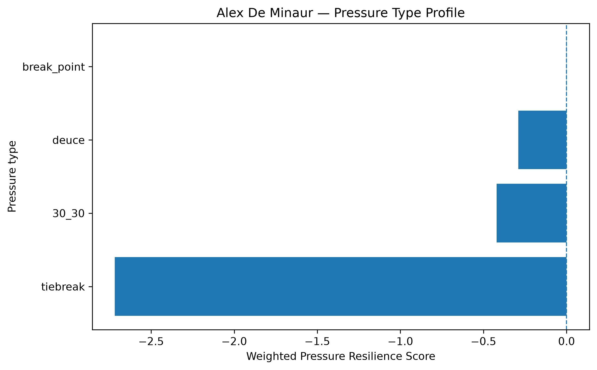
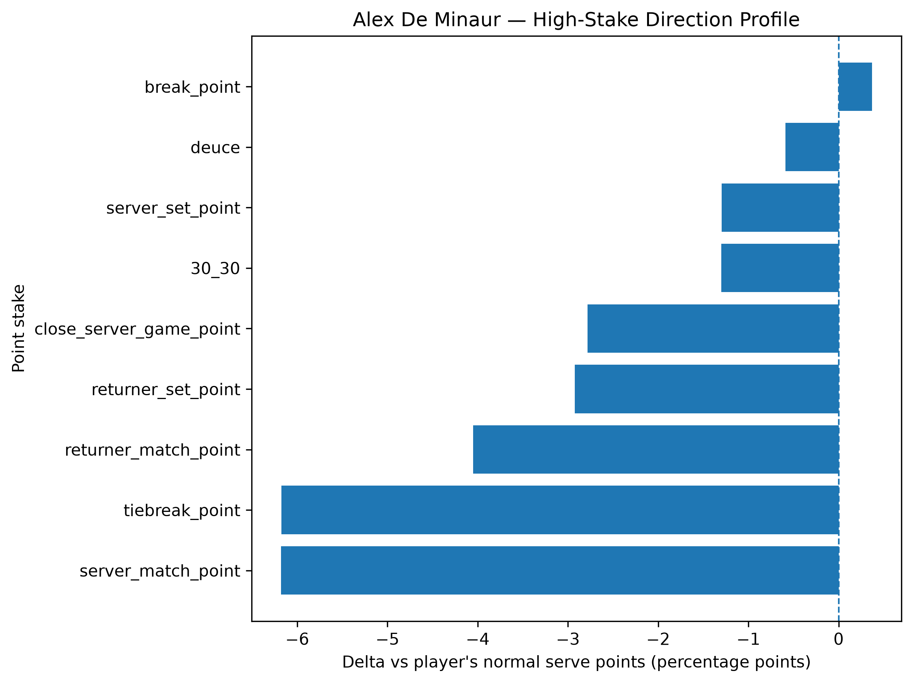
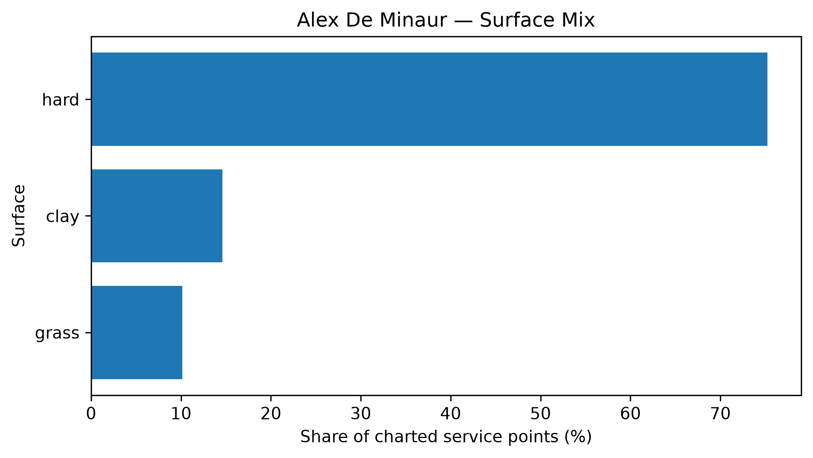

# Player Pressure Profile — Alex De Minaur

## Overall

- **Weighted Pressure Resilience Score:** -1.17
- **Average reliability score:** 31.55
- **Charted matches:** 114
- **Effective pressure points:** 2689
- **Sample period:** 2020-01-03 to 2026-04-24
- **Normal weighted serve win rate:** 62.44%

## Interpretation

- Alex De Minaur has a **negative pressure profile** in the final robust sample.
- His strongest pressure type is **break_point** with a score of **+0.00**.
- His weakest pressure type is **tiebreak** with a score of **-2.72**.
- Among high-stake situations, his best relative area is **break_point** (+0.37 percentage points vs normal).
- His weakest high-stake area is **server_match_point** (-6.18 percentage points vs normal).
- His dominant surface exposure in the charted sample is **hard**.

## Pressure type profile

| pressure_type   |   raw_n_pressure |   effective_n_pressure |   rate_normal |   rate_pressure |   delta_pp |   weighted_pressure_resilience_score |   reliability_score |
|:----------------|-----------------:|-----------------------:|--------------:|----------------:|-----------:|-------------------------------------:|--------------------:|
| break_point     |             1450 |               1391.09  |      0.624364 |        0.628046 |   0.368267 |                            0.0017693 |             0.48044 |
| deuce           |              659 |                631.109 |      0.624364 |        0.618478 |  -0.588544 |                           -0.290088  |            49.2891  |
| 30_30           |              454 |                435.855 |      0.624364 |        0.61137  |  -1.29938  |                           -0.421331  |            32.4257  |
| tiebreak        |              241 |                230.874 |      0.624364 |        0.562613 |  -6.17507  |                           -2.71849   |            44.0236  |

## High-stake direction profile

| stake                   |   raw_points |   weighted_serve_win_rate |   delta_vs_player_normal_pp |
|:------------------------|-------------:|--------------------------:|----------------------------:|
| normal                  |         5561 |                  0.628642 |                    0.427832 |
| 30_30                   |          454 |                  0.61137  |                   -1.29938  |
| deuce                   |          659 |                  0.618478 |                   -0.588544 |
| break_point             |         1450 |                  0.628046 |                    0.368267 |
| close_server_game_point |          633 |                  0.596533 |                   -2.78305  |
| server_set_point        |          105 |                  0.611419 |                   -1.29442  |
| returner_set_point      |          213 |                  0.595119 |                   -2.92451  |
| server_match_point      |           45 |                  0.562574 |                   -6.17901  |
| returner_match_point    |           76 |                  0.583863 |                   -4.05011  |
| tiebreak_point          |          241 |                  0.562613 |                   -6.17507  |

## Surface mix

| surface_group   |   raw_points |   surface_share |   weighted_serve_win_rate |
|:----------------|-------------:|----------------:|--------------------------:|
| hard            |         6798 |        0.752324 |                  0.633124 |
| clay            |         1320 |        0.146082 |                  0.568371 |
| grass           |          918 |        0.101594 |                  0.621782 |

## Tournament exposure

| tournament_level   |   raw_points |       share |
|:-------------------|-------------:|------------:|
| masters_1000       |         2318 | 0.256529    |
| grand_slam         |         2173 | 0.240483    |
| atp_500            |         2159 | 0.238933    |
| team_cup           |          807 | 0.0893094   |
| atp_250            |          774 | 0.0856574   |
| atp_finals         |          381 | 0.0421647   |
| davis_cup_finals   |          321 | 0.0355246   |
| davis_cup          |           94 | 0.0104028   |
| other              |            9 | 0.000996016 |
