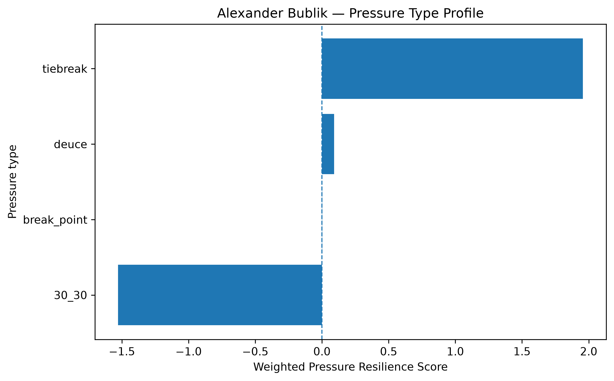
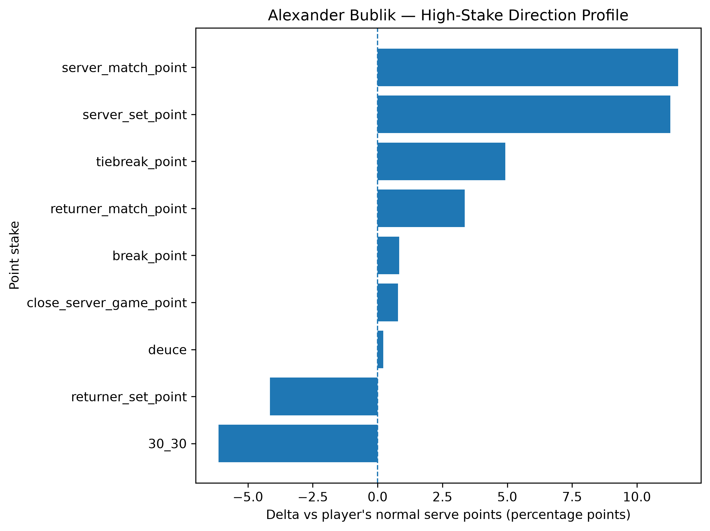
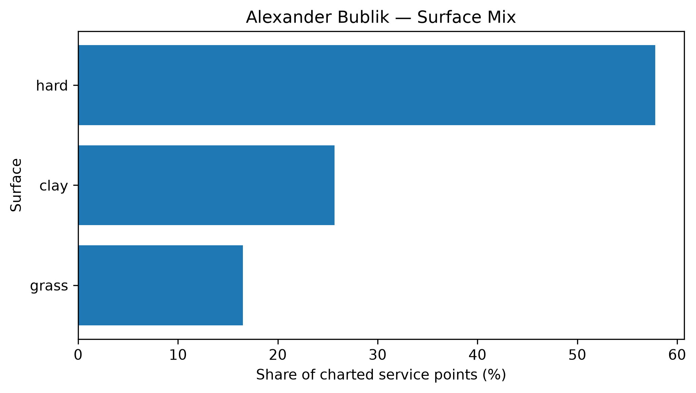

# Player Pressure Profile — Alexander Bublik

## Overall

- **Weighted Pressure Resilience Score:** +0.41
- **Average reliability score:** 26.49
- **Charted matches:** 87
- **Effective pressure points:** 1704
- **Sample period:** 2020-02-25 to 2026-04-10
- **Normal weighted serve win rate:** 63.00%

## Interpretation

- Alexander Bublik has a **near-neutral pressure profile** in the final robust sample.
- His strongest pressure type is **tiebreak** with a score of **+1.96**.
- His weakest pressure type is **30_30** with a score of **-1.53**.
- Among high-stake situations, his best relative area is **server_match_point** (+11.58 percentage points vs normal).
- His weakest high-stake area is **30_30** (-6.13 percentage points vs normal).
- His dominant surface exposure in the charted sample is **hard**.

## Pressure type profile

| pressure_type   |   raw_n_pressure |   effective_n_pressure |   rate_normal |   rate_pressure |   delta_pp |   weighted_pressure_resilience_score |   reliability_score |
|:----------------|-----------------:|-----------------------:|--------------:|----------------:|-----------:|-------------------------------------:|--------------------:|
| break_point     |              823 |                778.478 |      0.630002 |        0.638378 |   0.837574 |                           0.00239156 |            0.285534 |
| deuce           |              469 |                443.586 |      0.630002 |        0.632239 |   0.223684 |                           0.0917991  |           41.0397   |
| 30_30           |              329 |                309.915 |      0.630002 |        0.568693 |  -6.13095  |                          -1.52874    |           24.9348   |
| tiebreak        |              180 |                172.012 |      0.630002 |        0.679277 |   4.92748  |                           1.95698    |           39.7156   |

## High-stake direction profile

| stake                   |   raw_points |   weighted_serve_win_rate |   delta_vs_player_normal_pp |
|:------------------------|-------------:|--------------------------:|----------------------------:|
| normal                  |         4124 |                  0.628233 |                   -0.176893 |
| 30_30                   |          329 |                  0.568693 |                   -6.13095  |
| deuce                   |          469 |                  0.632239 |                    0.223684 |
| break_point             |          823 |                  0.638378 |                    0.837574 |
| close_server_game_point |          528 |                  0.637853 |                    0.785014 |
| server_set_point        |           80 |                  0.742875 |                   11.2872   |
| returner_set_point      |          108 |                  0.588542 |                   -4.14604  |
| server_match_point      |           38 |                  0.74585  |                   11.5848   |
| returner_match_point    |           43 |                  0.663558 |                    3.35556  |
| tiebreak_point          |          180 |                  0.679277 |                    4.92748  |

## Surface mix

| surface_group   |   raw_points |   surface_share |   weighted_serve_win_rate |
|:----------------|-------------:|----------------:|--------------------------:|
| hard            |         3749 |        0.578192 |                  0.623302 |
| clay            |         1665 |        0.256786 |                  0.61113  |
| grass           |         1070 |        0.165022 |                  0.683059 |

## Tournament exposure

| tournament_level   |   raw_points |     share |
|:-------------------|-------------:|----------:|
| atp_500            |         1672 | 0.257866  |
| atp_250            |         1573 | 0.242597  |
| grand_slam         |         1430 | 0.220543  |
| masters_1000       |         1098 | 0.16934   |
| challenger         |          197 | 0.0303825 |
| davis_cup          |          187 | 0.0288402 |
| other              |          143 | 0.0220543 |
| team_cup           |          104 | 0.0160395 |
| olympics           |           80 | 0.0123381 |
