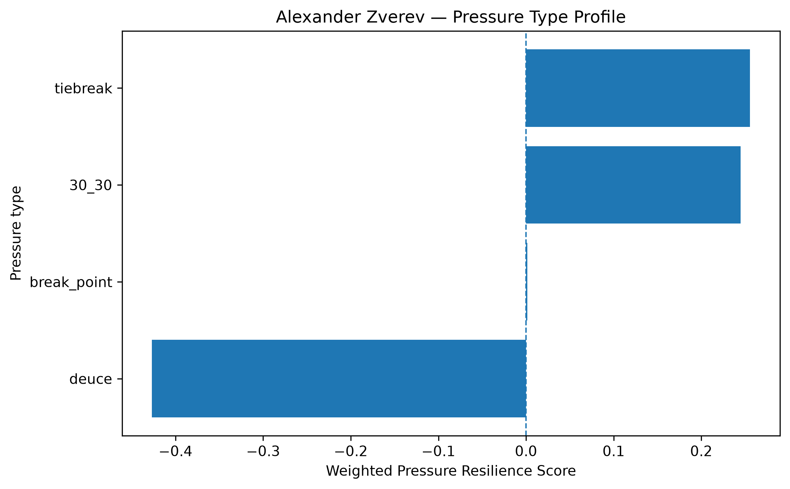
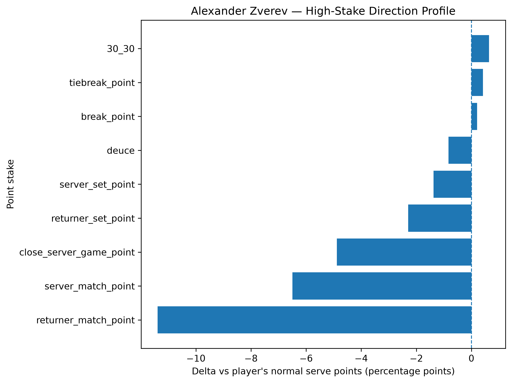
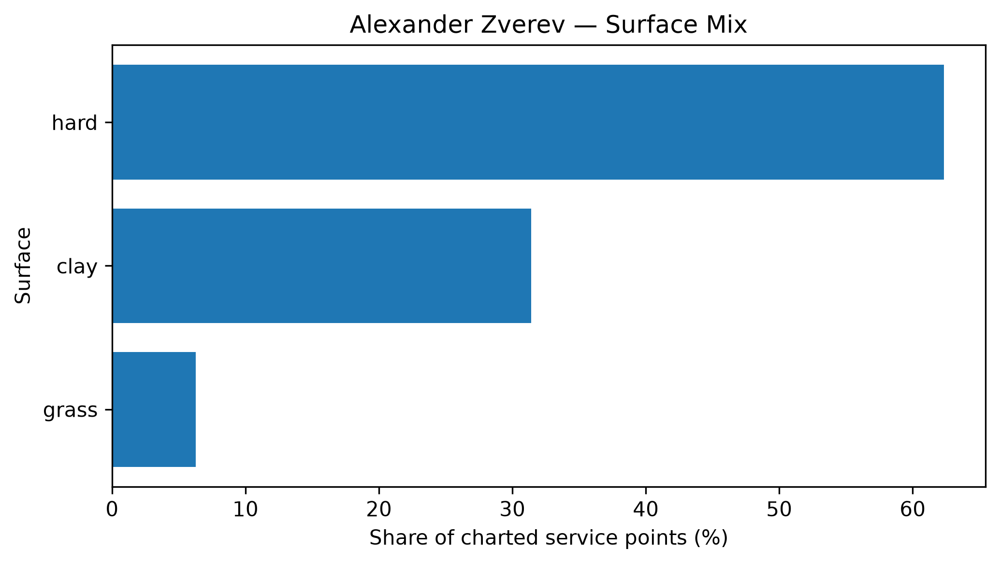

# Player Pressure Profile — Alexander Zverev

## Overall

- **Weighted Pressure Resilience Score:** +0.02
- **Average reliability score:** 37.81
- **Charted matches:** 140
- **Effective pressure points:** 3398
- **Sample period:** 2020-01-03 to 2026-05-03
- **Normal weighted serve win rate:** 66.81%

## Interpretation

- Alexander Zverev has a **near-neutral pressure profile** in the final robust sample.
- His strongest pressure type is **tiebreak** with a score of **+0.26**.
- His weakest pressure type is **deuce** with a score of **-0.43**.
- Among high-stake situations, his best relative area is **30_30** (+0.64 percentage points vs normal).
- His weakest high-stake area is **returner_match_point** (-11.39 percentage points vs normal).
- His dominant surface exposure in the charted sample is **hard**.

## Pressure type profile

| pressure_type   |   raw_n_pressure |   effective_n_pressure |   rate_normal |   rate_pressure |   delta_pp |   weighted_pressure_resilience_score |   reliability_score |
|:----------------|-----------------:|-----------------------:|--------------:|----------------:|-----------:|-------------------------------------:|--------------------:|
| break_point     |             1893 |               1824.39  |       0.66807 |        0.670153 |   0.20829  |                           0.00138818 |            0.666462 |
| deuce           |              667 |                641.831 |       0.66807 |        0.659785 |  -0.828442 |                          -0.426928   |           51.5339   |
| 30_30           |              542 |                522.988 |       0.66807 |        0.674426 |   0.635628 |                           0.244776   |           38.5093   |
| tiebreak        |              423 |                408.639 |       0.66807 |        0.672295 |   0.422519 |                           0.255696   |           60.5171   |

## High-stake direction profile

| stake                   |   raw_points |   weighted_serve_win_rate |   delta_vs_player_normal_pp |
|:------------------------|-------------:|--------------------------:|----------------------------:|
| normal                  |         7554 |                  0.672304 |                    0.423399 |
| 30_30                   |          542 |                  0.674426 |                    0.635628 |
| deuce                   |          667 |                  0.659785 |                   -0.828442 |
| break_point             |         1893 |                  0.670153 |                    0.20829  |
| close_server_game_point |          658 |                  0.619239 |                   -4.88304  |
| server_set_point        |          126 |                  0.654322 |                   -1.3748   |
| returner_set_point      |          217 |                  0.645141 |                   -2.2929   |
| server_match_point      |           42 |                  0.603073 |                   -6.4997   |
| returner_match_point    |           70 |                  0.554183 |                  -11.3887   |
| tiebreak_point          |          423 |                  0.672295 |                    0.422519 |

## Surface mix

| surface_group   |   raw_points |   surface_share |   weighted_serve_win_rate |
|:----------------|-------------:|----------------:|--------------------------:|
| hard            |         7338 |       0.623396  |                  0.678804 |
| clay            |         3696 |       0.313992  |                  0.643088 |
| grass           |          737 |       0.0626115 |                  0.697597 |

## Tournament exposure

| tournament_level   |   raw_points |     share |
|:-------------------|-------------:|----------:|
| grand_slam         |         4683 | 0.397842  |
| masters_1000       |         4245 | 0.360632  |
| atp_500            |         1301 | 0.110526  |
| atp_finals         |          735 | 0.0624416 |
| team_cup           |          454 | 0.0385694 |
| olympics           |          206 | 0.0175006 |
| atp_250            |          147 | 0.0124883 |
