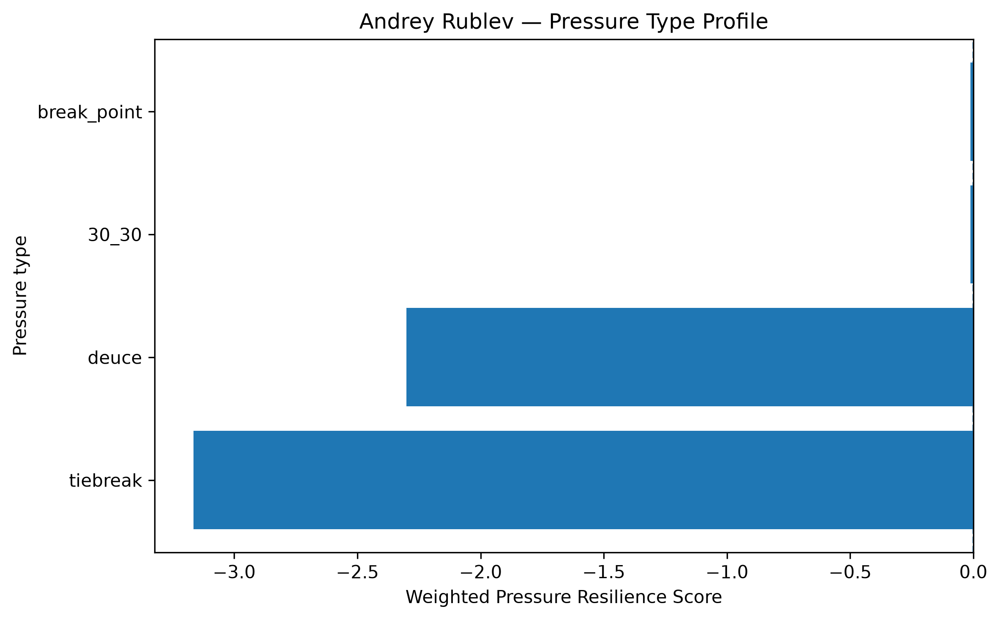
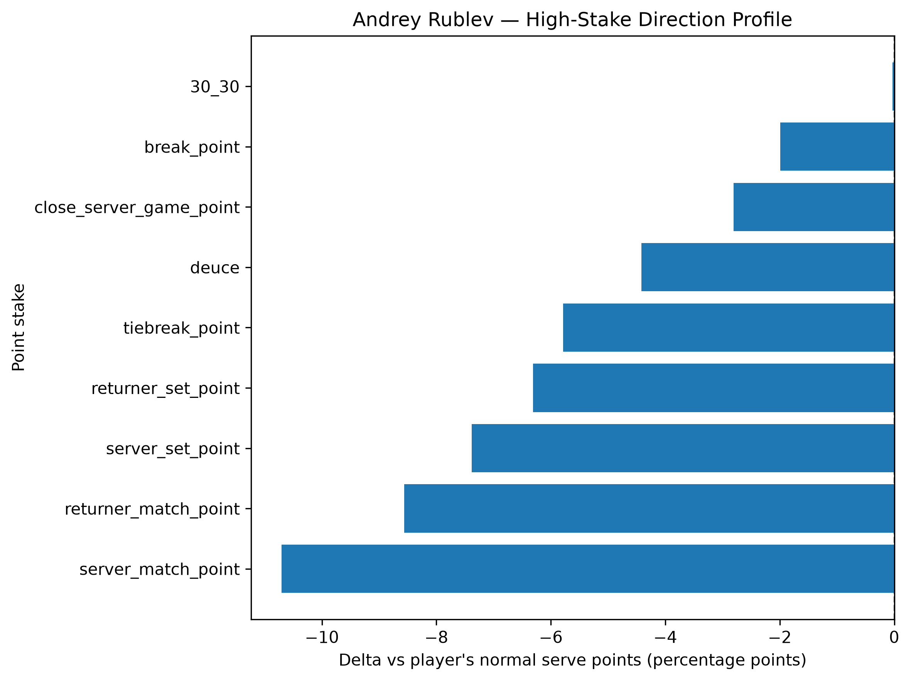
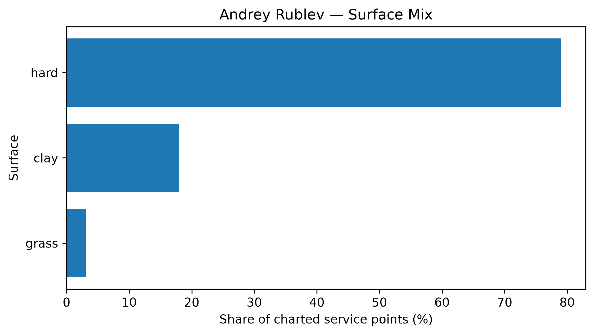

# Player Pressure Profile — Andrey Rublev

## Overall

- **Weighted Pressure Resilience Score:** -2.02
- **Average reliability score:** 36.40
- **Charted matches:** 162
- **Effective pressure points:** 3102
- **Sample period:** 2020-01-10 to 2026-04-19
- **Normal weighted serve win rate:** 67.33%

## Interpretation

- Andrey Rublev has a **negative pressure profile** in the final robust sample.
- His strongest pressure type is **break_point** with a score of **-0.01**.
- His weakest pressure type is **tiebreak** with a score of **-3.17**.
- Among high-stake situations, his best relative area is **30_30** (-0.03 percentage points vs normal).
- His weakest high-stake area is **server_match_point** (-10.70 percentage points vs normal).
- His dominant surface exposure in the charted sample is **hard**.

## Pressure type profile

| pressure_type   |   raw_n_pressure |   effective_n_pressure |   rate_normal |   rate_pressure |   delta_pp |   weighted_pressure_resilience_score |   reliability_score |
|:----------------|-----------------:|-----------------------:|--------------:|----------------:|-----------:|-------------------------------------:|--------------------:|
| break_point     |             1625 |               1564.63  |      0.673267 |        0.653352 | -1.99147   |                           -0.0115708 |             0.58102 |
| deuce           |              708 |                681.509 |      0.673267 |        0.62912  | -4.41466   |                           -2.30129   |            52.1284  |
| 30_30           |              536 |                514.485 |      0.673267 |        0.672944 | -0.0323381 |                           -0.0123444 |            38.173   |
| tiebreak        |              356 |                341.412 |      0.673267 |        0.615401 | -5.78656   |                           -3.16554   |            54.705   |

## High-stake direction profile

| stake                   |   raw_points |   weighted_serve_win_rate |   delta_vs_player_normal_pp |
|:------------------------|-------------:|--------------------------:|----------------------------:|
| normal                  |         7819 |                  0.676317 |                   0.305008  |
| 30_30                   |          536 |                  0.672944 |                  -0.0323381 |
| deuce                   |          708 |                  0.62912  |                  -4.41466   |
| break_point             |         1625 |                  0.653352 |                  -1.99147   |
| close_server_game_point |          808 |                  0.645229 |                  -2.80382   |
| server_set_point        |          177 |                  0.599431 |                  -7.38364   |
| returner_set_point      |          216 |                  0.610166 |                  -6.31013   |
| server_match_point      |           74 |                  0.566229 |                 -10.7039    |
| returner_match_point    |           72 |                  0.587648 |                  -8.56191   |
| tiebreak_point          |          356 |                  0.615401 |                  -5.78656   |

## Surface mix

| surface_group   |   raw_points |   surface_share |   weighted_serve_win_rate |
|:----------------|-------------:|----------------:|--------------------------:|
| hard            |         9420 |        0.790003 |                  0.675338 |
| clay            |         2135 |        0.179051 |                  0.627417 |
| grass           |          369 |        0.030946 |                  0.656991 |

## Tournament exposure

| tournament_level   |   raw_points |     share |
|:-------------------|-------------:|----------:|
| masters_1000       |         3712 | 0.311305  |
| grand_slam         |         2875 | 0.24111   |
| atp_500            |         2621 | 0.219809  |
| atp_250            |         1470 | 0.123281  |
| atp_finals         |          848 | 0.0711171 |
| other              |          220 | 0.0184502 |
| team_cup           |          178 | 0.0149279 |
