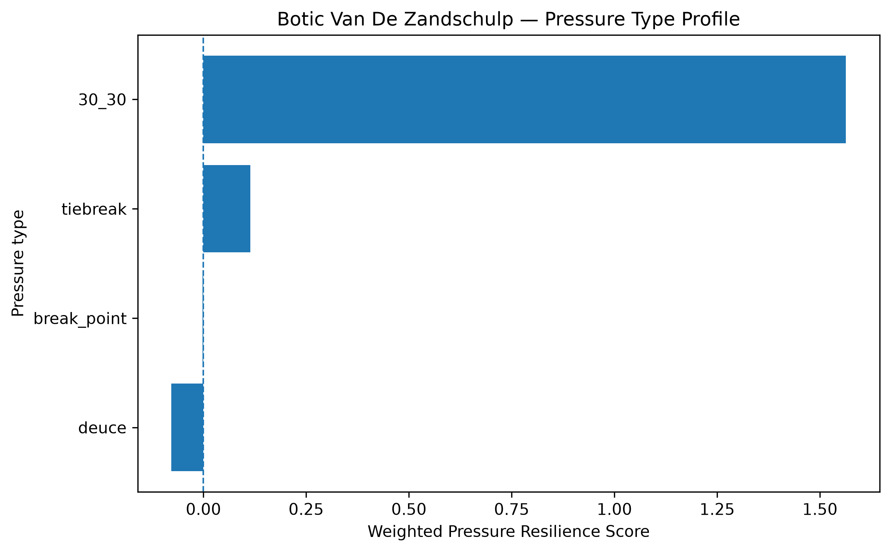
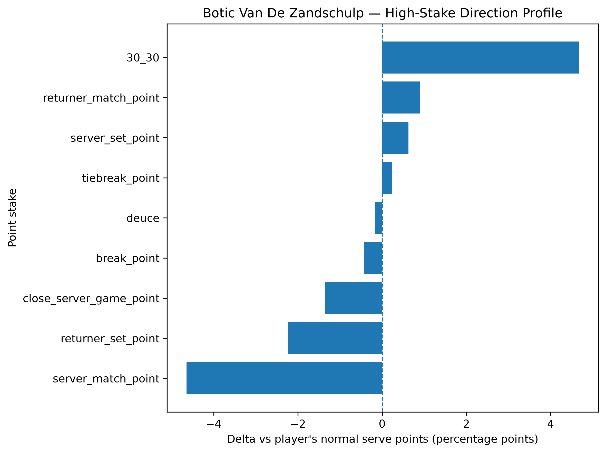
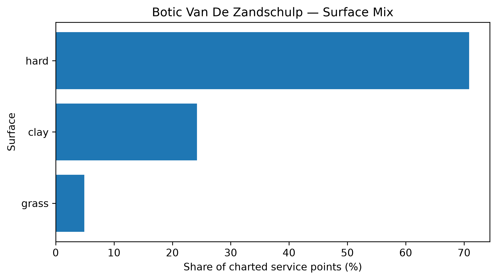

# Player Pressure Profile — Botic Van De Zandschulp

## Overall

- **Weighted Pressure Resilience Score:** +0.41
- **Average reliability score:** 33.32
- **Charted matches:** 106
- **Effective pressure points:** 2709
- **Sample period:** 2020-02-22 to 2026-04-04
- **Normal weighted serve win rate:** 62.02%

## Interpretation

- Botic Van De Zandschulp has a **near-neutral pressure profile** in the final robust sample.
- His strongest pressure type is **30_30** with a score of **+1.56**.
- His weakest pressure type is **deuce** with a score of **-0.08**.
- Among high-stake situations, his best relative area is **30_30** (+4.67 percentage points vs normal).
- His weakest high-stake area is **server_match_point** (-4.64 percentage points vs normal).
- His dominant surface exposure in the charted sample is **hard**.

## Pressure type profile

| pressure_type   |   raw_n_pressure |   effective_n_pressure |   rate_normal |   rate_pressure |   delta_pp |   weighted_pressure_resilience_score |   reliability_score |
|:----------------|-----------------:|-----------------------:|--------------:|----------------:|-----------:|-------------------------------------:|--------------------:|
| break_point     |             1460 |               1367.77  |      0.620175 |        0.615845 |  -0.433047 |                          -0.00202362 |            0.467297 |
| deuce           |              664 |                622.963 |      0.620175 |        0.61858  |  -0.159564 |                          -0.0781042  |           48.9486   |
| 30_30           |              459 |                430.23  |      0.620175 |        0.666832 |   4.6657   |                           1.56337    |           33.5076   |
| tiebreak        |              305 |                287.689 |      0.620175 |        0.622439 |   0.226342 |                           0.11397    |           50.3531   |

## High-stake direction profile

| stake                   |   raw_points |   weighted_serve_win_rate |   delta_vs_player_normal_pp |
|:------------------------|-------------:|--------------------------:|----------------------------:|
| normal                  |         5604 |                  0.621367 |                    0.119159 |
| 30_30                   |          459 |                  0.666832 |                    4.6657   |
| deuce                   |          664 |                  0.61858  |                   -0.159564 |
| break_point             |         1460 |                  0.615845 |                   -0.433047 |
| close_server_game_point |          641 |                  0.606553 |                   -1.36227  |
| server_set_point        |           97 |                  0.62642  |                    0.624479 |
| returner_set_point      |          242 |                  0.597783 |                   -2.23928  |
| server_match_point      |           37 |                  0.573742 |                   -4.64332  |
| returner_match_point    |           61 |                  0.629209 |                    0.90337  |
| tiebreak_point          |          305 |                  0.622439 |                    0.226342 |

## Surface mix

| surface_group   |   raw_points |   surface_share |   weighted_serve_win_rate |
|:----------------|-------------:|----------------:|--------------------------:|
| hard            |         6492 |       0.708734  |                  0.622599 |
| clay            |         2220 |       0.242358  |                  0.606012 |
| grass           |          448 |       0.0489083 |                  0.671287 |

## Tournament exposure

| tournament_level   |   raw_points |     share |
|:-------------------|-------------:|----------:|
| grand_slam         |         3116 | 0.340175  |
| masters_1000       |         1637 | 0.178712  |
| atp_250            |         1225 | 0.133734  |
| other              |          745 | 0.0813319 |
| davis_cup_finals   |          648 | 0.0707424 |
| davis_cup          |          635 | 0.0693231 |
| atp_500            |          604 | 0.0659389 |
| challenger         |          550 | 0.0600437 |
