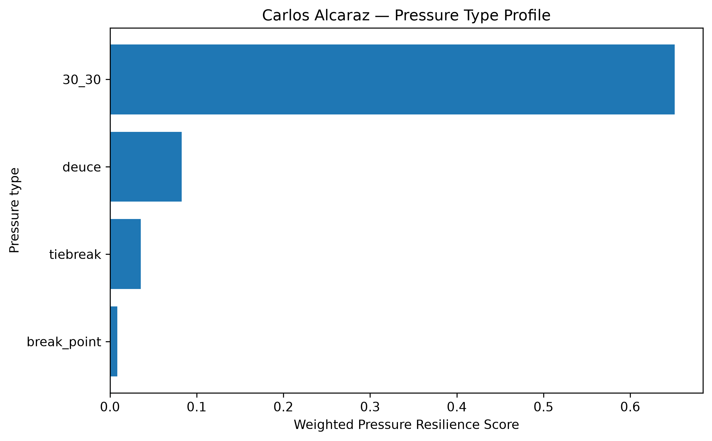
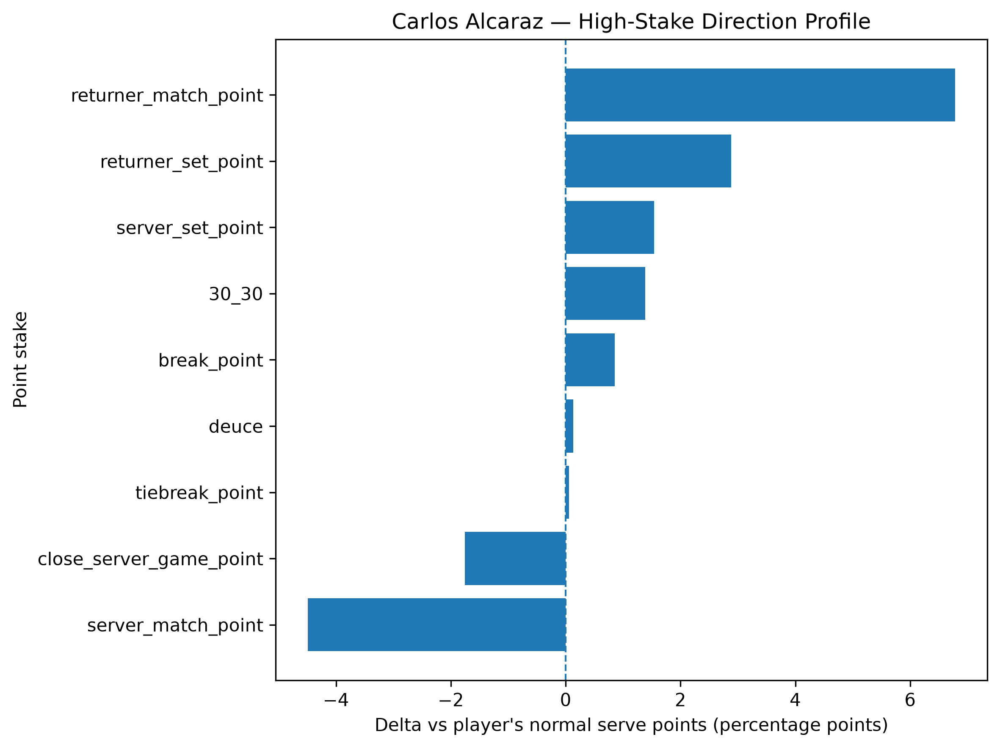
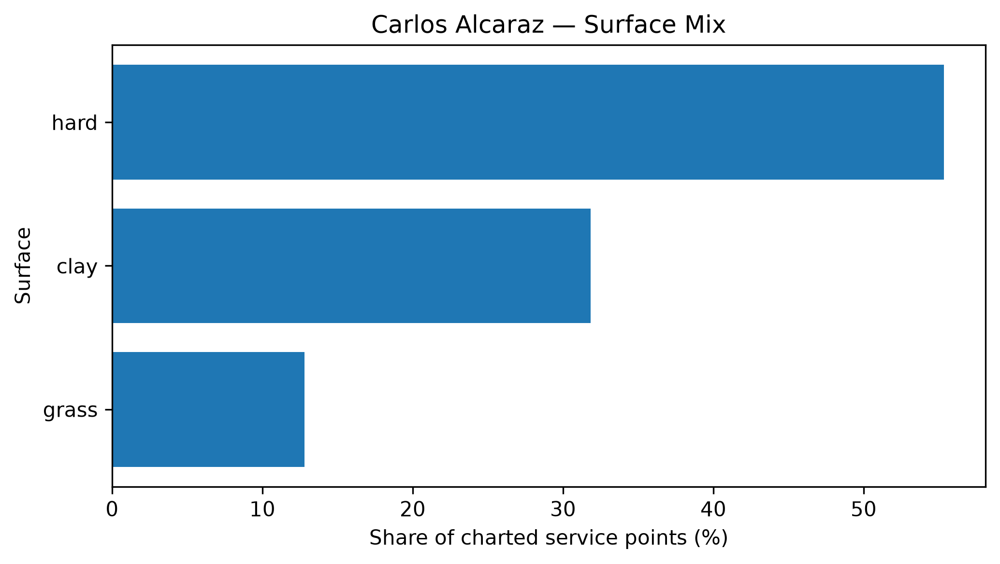

# Player Pressure Profile — Carlos Alcaraz

## Overall

- **Weighted Pressure Resilience Score:** +0.22
- **Average reliability score:** 43.54
- **Charted matches:** 219
- **Effective pressure points:** 4871
- **Sample period:** 2020-02-18 to 2026-04-12
- **Normal weighted serve win rate:** 66.40%

## Interpretation

- Carlos Alcaraz has a **near-neutral pressure profile** in the final robust sample.
- His strongest pressure type is **30_30** with a score of **+0.65**.
- His weakest pressure type is **break_point** with a score of **+0.01**.
- Among high-stake situations, his best relative area is **returner_match_point** (+6.78 percentage points vs normal).
- His weakest high-stake area is **server_match_point** (-4.49 percentage points vs normal).
- His dominant surface exposure in the charted sample is **hard**.

## Pressure type profile

| pressure_type   |   raw_n_pressure |   effective_n_pressure |   rate_normal |   rate_pressure |   delta_pp |   weighted_pressure_resilience_score |   reliability_score |
|:----------------|-----------------:|-----------------------:|--------------:|----------------:|-----------:|-------------------------------------:|--------------------:|
| break_point     |             2810 |               2671.46  |      0.663987 |        0.672522 |  0.853549  |                           0.00834247 |            0.977386 |
| deuce           |             1041 |                990.301 |      0.663987 |        0.665313 |  0.132641  |                           0.0825389  |           62.2272   |
| 30_30           |              775 |                738.45  |      0.663987 |        0.677808 |  1.38213   |                           0.651333   |           47.1253   |
| tiebreak        |              492 |                470.76  |      0.663987 |        0.664543 |  0.0555902 |                           0.035485   |           63.8333   |

## High-stake direction profile

| stake                   |   raw_points |   weighted_serve_win_rate |   delta_vs_player_normal_pp |
|:------------------------|-------------:|--------------------------:|----------------------------:|
| normal                  |        11283 |                  0.665251 |                   0.126406  |
| 30_30                   |          775 |                  0.677808 |                   1.38213   |
| deuce                   |         1041 |                  0.665313 |                   0.132641  |
| break_point             |         2810 |                  0.672522 |                   0.853549  |
| close_server_game_point |         1035 |                  0.646443 |                  -1.75441   |
| server_set_point        |          209 |                  0.679365 |                   1.5378    |
| returner_set_point      |          278 |                  0.692817 |                   2.88304   |
| server_match_point      |           82 |                  0.619092 |                  -4.48944   |
| returner_match_point    |           57 |                  0.731793 |                   6.78058   |
| tiebreak_point          |          492 |                  0.664543 |                   0.0555902 |

## Surface mix

| surface_group   |   raw_points |   surface_share |   weighted_serve_win_rate |
|:----------------|-------------:|----------------:|--------------------------:|
| hard            |         9697 |        0.553387 |                  0.675698 |
| clay            |         5581 |        0.318496 |                  0.645588 |
| grass           |         2245 |        0.128117 |                  0.673914 |

## Tournament exposure

| tournament_level   |   raw_points |      share |
|:-------------------|-------------:|-----------:|
| grand_slam         |         7208 | 0.411345   |
| masters_1000       |         5459 | 0.311533   |
| atp_500            |         3200 | 0.182617   |
| atp_250            |          921 | 0.0525595  |
| atp_finals         |          412 | 0.023512   |
| other              |          165 | 0.0094162  |
| olympics           |          107 | 0.00610626 |
| davis_cup_finals   |           51 | 0.00291046 |
