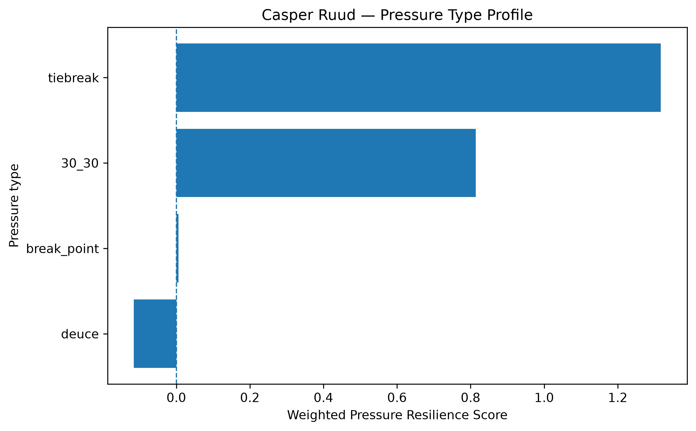
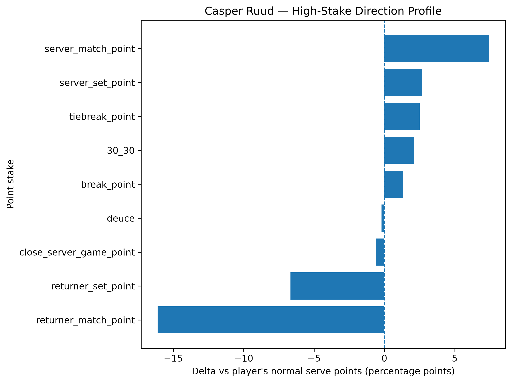
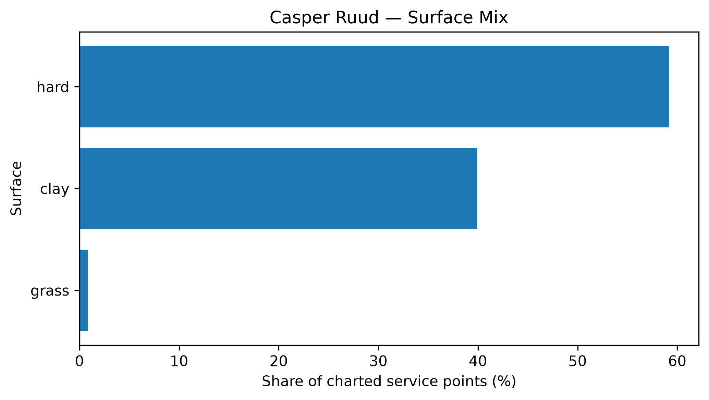

# Player Pressure Profile — Casper Ruud

## Overall

- **Weighted Pressure Resilience Score:** +0.64
- **Average reliability score:** 36.62
- **Charted matches:** 162
- **Effective pressure points:** 2601
- **Sample period:** 2020-01-05 to 2026-05-17
- **Normal weighted serve win rate:** 65.85%

## Interpretation

- Casper Ruud has a **positive pressure profile** in the final robust sample.
- His strongest pressure type is **tiebreak** with a score of **+1.32**.
- His weakest pressure type is **deuce** with a score of **-0.12**.
- Among high-stake situations, his best relative area is **server_match_point** (+7.43 percentage points vs normal).
- His weakest high-stake area is **returner_match_point** (-16.11 percentage points vs normal).
- His dominant surface exposure in the charted sample is **hard**.

## Pressure type profile

| pressure_type   |   raw_n_pressure |   effective_n_pressure |   rate_normal |   rate_pressure |   delta_pp |   weighted_pressure_resilience_score |   reliability_score |
|:----------------|-----------------:|-----------------------:|--------------:|----------------:|-----------:|-------------------------------------:|--------------------:|
| break_point     |             1114 |               1062.29  |      0.658515 |        0.671799 |   1.32844  |                           0.00570273 |             0.42928 |
| deuce           |              781 |                743.04  |      0.658515 |        0.656418 |  -0.209679 |                          -0.115418   |            55.0448  |
| 30_30           |              536 |                509.606 |      0.658515 |        0.679773 |   2.12588  |                           0.814392   |            38.3085  |
| tiebreak        |              300 |                286.334 |      0.658515 |        0.683506 |   2.49917  |                           1.31719    |            52.705   |

## High-stake direction profile

| stake                   |   raw_points |   weighted_serve_win_rate |   delta_vs_player_normal_pp |
|:------------------------|-------------:|--------------------------:|----------------------------:|
| normal                  |         8514 |                  0.658572 |                  0.00576345 |
| 30_30                   |          536 |                  0.679773 |                  2.12588    |
| deuce                   |          781 |                  0.656418 |                 -0.209679   |
| break_point             |         1114 |                  0.671799 |                  1.32844    |
| close_server_game_point |         1073 |                  0.652458 |                 -0.605663   |
| server_set_point        |          233 |                  0.685305 |                  2.67901    |
| returner_set_point      |          130 |                  0.591775 |                 -6.67396    |
| server_match_point      |          100 |                  0.732812 |                  7.42969    |
| returner_match_point    |           37 |                  0.497384 |                -16.1131     |
| tiebreak_point          |          300 |                  0.683506 |                  2.49917    |

## Surface mix

| surface_group   |   raw_points |   surface_share |   weighted_serve_win_rate |
|:----------------|-------------:|----------------:|--------------------------:|
| hard            |         7360 |      0.591925   |                  0.666647 |
| clay            |         4967 |      0.399469   |                  0.651502 |
| grass           |          107 |      0.00860544 |                  0.719626 |

## Tournament exposure

| tournament_level   |   raw_points |      share |
|:-------------------|-------------:|-----------:|
| masters_1000       |         4434 | 0.356603   |
| grand_slam         |         3804 | 0.305935   |
| atp_250            |         1780 | 0.143156   |
| atp_500            |         1128 | 0.090719   |
| atp_finals         |          745 | 0.0599164  |
| team_cup           |          329 | 0.0264597  |
| other              |          152 | 0.0122245  |
| olympics           |           62 | 0.00498633 |
