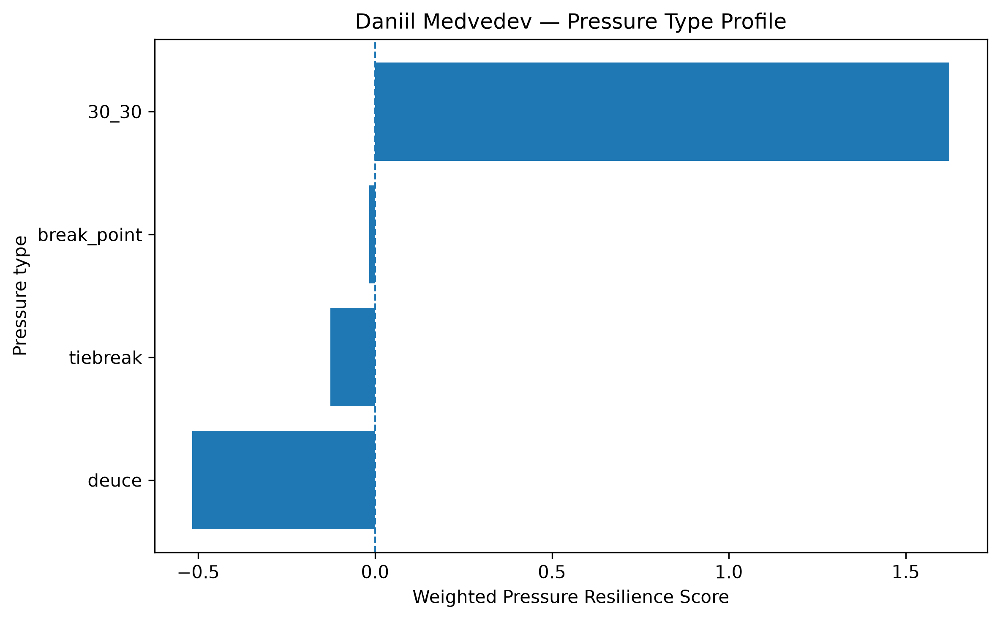
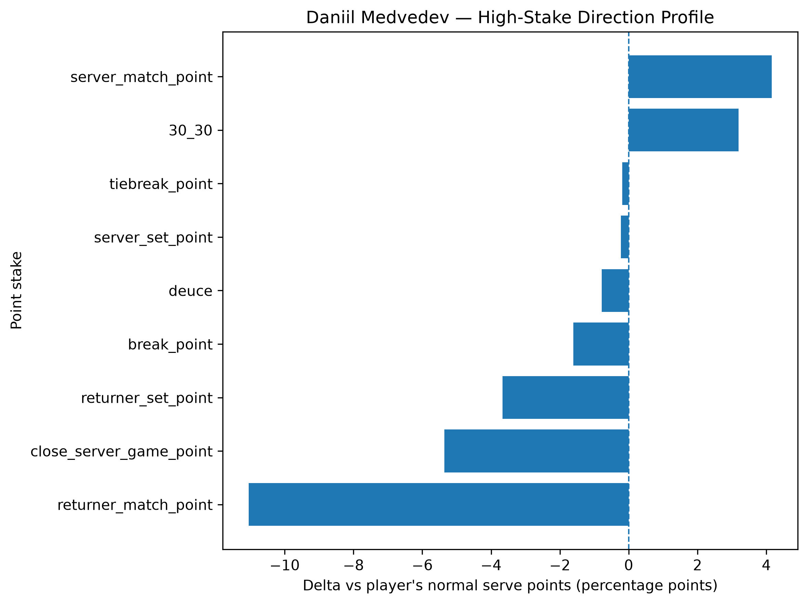
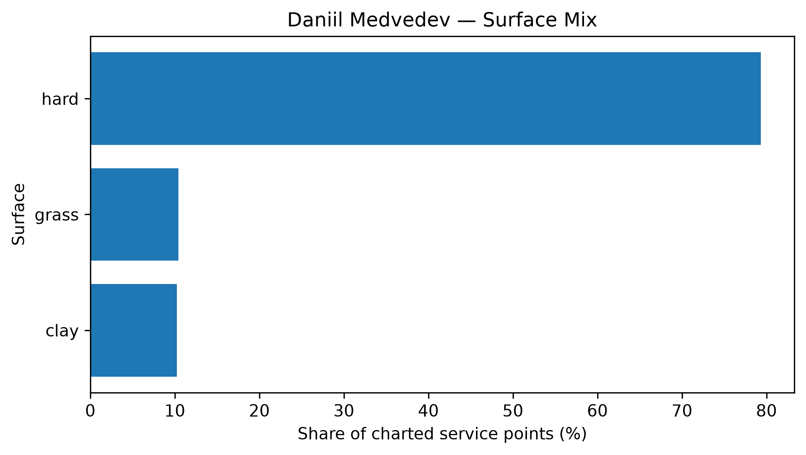

# Player Pressure Profile — Daniil Medvedev

## Overall

- **Weighted Pressure Resilience Score:** +0.21
- **Average reliability score:** 46.41
- **Charted matches:** 239
- **Effective pressure points:** 5625
- **Sample period:** 2020-01-11 to 2026-04-08
- **Normal weighted serve win rate:** 66.24%

## Interpretation

- Daniil Medvedev has a **near-neutral pressure profile** in the final robust sample.
- His strongest pressure type is **30_30** with a score of **+1.62**.
- His weakest pressure type is **deuce** with a score of **-0.52**.
- Among high-stake situations, his best relative area is **server_match_point** (+4.15 percentage points vs normal).
- His weakest high-stake area is **returner_match_point** (-11.04 percentage points vs normal).
- His dominant surface exposure in the charted sample is **hard**.

## Pressure type profile

| pressure_type   |   raw_n_pressure |   effective_n_pressure |   rate_normal |   rate_pressure |   delta_pp |   weighted_pressure_resilience_score |   reliability_score |
|:----------------|-----------------:|-----------------------:|--------------:|----------------:|-----------:|-------------------------------------:|--------------------:|
| break_point     |             3175 |               3020.76  |       0.66237 |        0.646225 |  -1.61456  |                           -0.0170507 |             1.05606 |
| deuce           |             1261 |               1201.29  |       0.66237 |        0.654549 |  -0.78209  |                           -0.516694  |            66.0658  |
| 30_30           |              879 |                837.72  |       0.66237 |        0.694321 |   3.19505  |                            1.62368   |            50.8187  |
| tiebreak        |              588 |                565.307 |       0.66237 |        0.660509 |  -0.186163 |                           -0.12603   |            67.6989  |

## High-stake direction profile

| stake                   |   raw_points |   weighted_serve_win_rate |   delta_vs_player_normal_pp |
|:------------------------|-------------:|--------------------------:|----------------------------:|
| normal                  |        11808 |                  0.667554 |                    0.518351 |
| 30_30                   |          879 |                  0.694321 |                    3.19505  |
| deuce                   |         1261 |                  0.654549 |                   -0.78209  |
| break_point             |         3175 |                  0.646225 |                   -1.61456  |
| close_server_game_point |         1163 |                  0.608806 |                   -5.35647  |
| server_set_point        |          228 |                  0.6601   |                   -0.226998 |
| returner_set_point      |          375 |                  0.625666 |                   -3.67039  |
| server_match_point      |           80 |                  0.7039   |                    4.15293  |
| returner_match_point    |          120 |                  0.551944 |                  -11.0427   |
| tiebreak_point          |          588 |                  0.660509 |                   -0.186163 |

## Surface mix

| surface_group   |   raw_points |   surface_share |   weighted_serve_win_rate |
|:----------------|-------------:|----------------:|--------------------------:|
| hard            |        15037 |        0.793216 |                  0.666307 |
| clay            |         1945 |        0.102601 |                  0.609589 |
| grass           |         1975 |        0.104183 |                  0.668139 |

## Tournament exposure

| tournament_level   |   raw_points |      share |
|:-------------------|-------------:|-----------:|
| grand_slam         |         6914 | 0.36472    |
| masters_1000       |         5298 | 0.279475   |
| atp_500            |         3564 | 0.188004   |
| atp_250            |         1454 | 0.0766999  |
| atp_finals         |         1027 | 0.0541752  |
| other              |          318 | 0.0167748  |
| team_cup           |          199 | 0.0104974  |
| olympics           |          183 | 0.00965343 |
