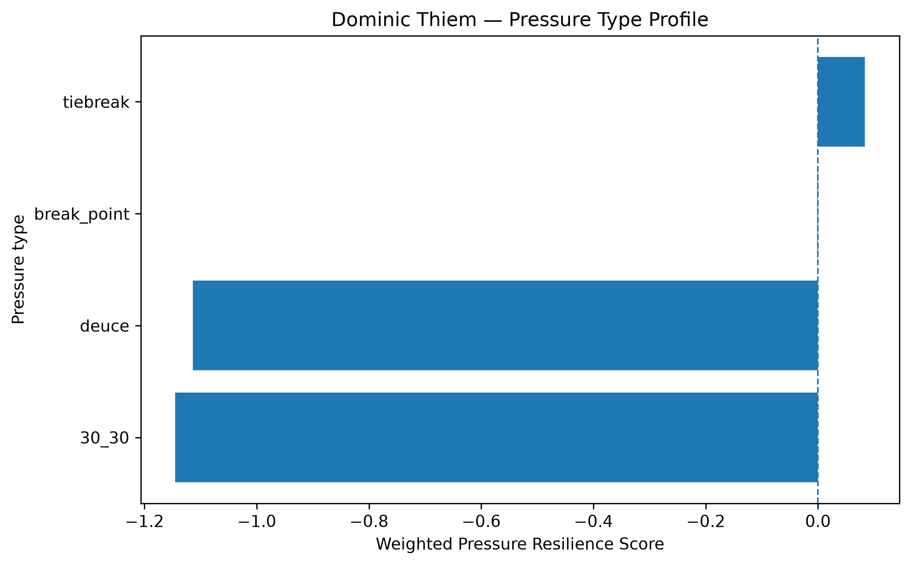
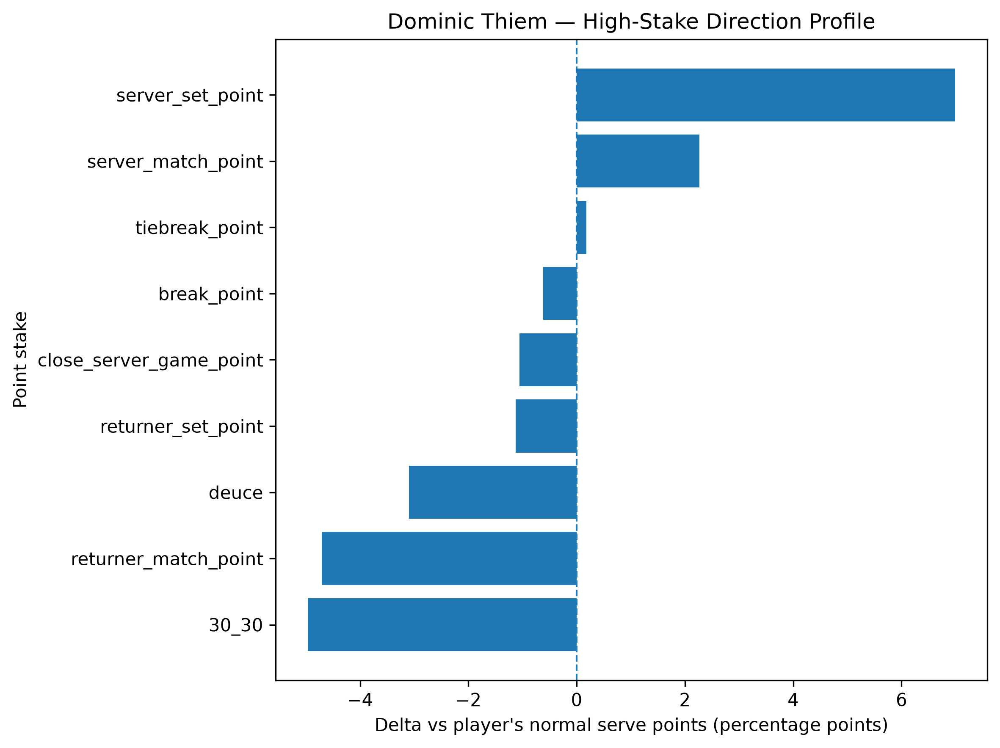
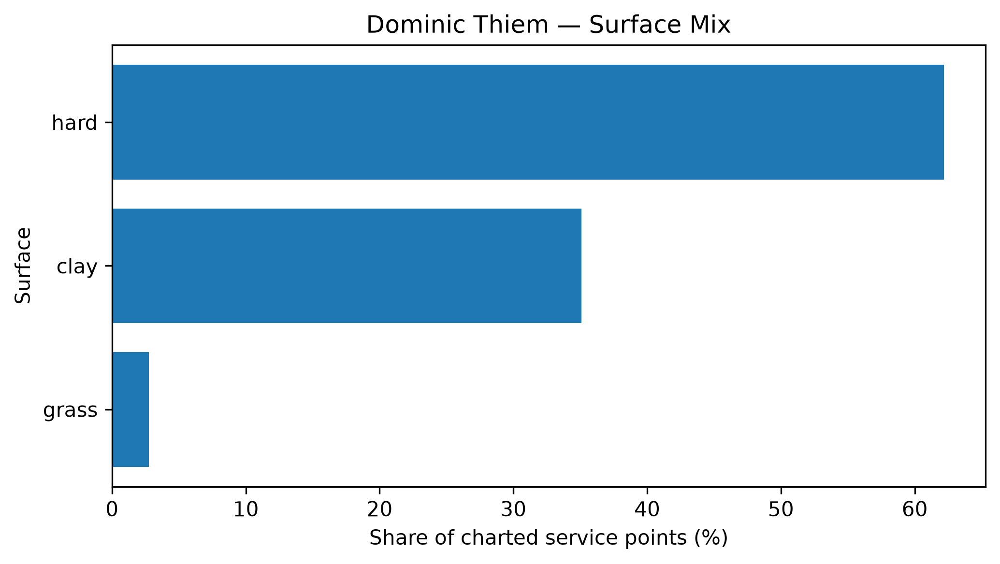

# Player Pressure Profile — Dominic Thiem

## Overall

- **Weighted Pressure Resilience Score:** -0.59
- **Average reliability score:** 26.62
- **Charted matches:** 75
- **Effective pressure points:** 1729
- **Sample period:** 2020-01-08 to 2024-10-22
- **Normal weighted serve win rate:** 64.97%

## Interpretation

- Dominic Thiem has a **negative pressure profile** in the final robust sample.
- His strongest pressure type is **tiebreak** with a score of **+0.08**.
- His weakest pressure type is **30_30** with a score of **-1.15**.
- Among high-stake situations, his best relative area is **server_set_point** (+6.99 percentage points vs normal).
- His weakest high-stake area is **30_30** (-4.96 percentage points vs normal).
- His dominant surface exposure in the charted sample is **hard**.

## Pressure type profile

| pressure_type   |   raw_n_pressure |   effective_n_pressure |   rate_normal |   rate_pressure |   delta_pp |   weighted_pressure_resilience_score |   reliability_score |
|:----------------|-----------------:|-----------------------:|--------------:|----------------:|-----------:|-------------------------------------:|--------------------:|
| break_point     |              957 |                850.718 |      0.649729 |        0.64353  |  -0.619872 |                          -0.00189763 |            0.306132 |
| deuce           |              400 |                357.726 |      0.649729 |        0.618749 |  -3.09796  |                          -1.11363    |           35.9473   |
| 30_30           |              309 |                273.049 |      0.649729 |        0.60009  |  -4.96386  |                          -1.14528    |           23.0723   |
| tiebreak        |              278 |                247.421 |      0.649729 |        0.651504 |   0.177535 |                           0.0837313  |           47.1632   |

## High-stake direction profile

| stake                   |   raw_points |   weighted_serve_win_rate |   delta_vs_player_normal_pp |
|:------------------------|-------------:|--------------------------:|----------------------------:|
| normal                  |         4096 |                  0.650747 |                    0.101813 |
| 30_30                   |          309 |                  0.60009  |                   -4.96386  |
| deuce                   |          400 |                  0.618749 |                   -3.09796  |
| break_point             |          957 |                  0.64353  |                   -0.619872 |
| close_server_game_point |          438 |                  0.63919  |                   -1.05386  |
| server_set_point        |           84 |                  0.719594 |                    6.98653  |
| returner_set_point      |          154 |                  0.638459 |                   -1.12694  |
| server_match_point      |           32 |                  0.672427 |                    2.26982  |
| returner_match_point    |           56 |                  0.602683 |                   -4.70454  |
| tiebreak_point          |          278 |                  0.651504 |                    0.177535 |

## Surface mix

| surface_group   |   raw_points |   surface_share |   weighted_serve_win_rate |
|:----------------|-------------:|----------------:|--------------------------:|
| hard            |         4047 |       0.621754  |                  0.649941 |
| clay            |         2284 |       0.350899  |                  0.625287 |
| grass           |          178 |       0.0273468 |                  0.702247 |

## Tournament exposure

| tournament_level   |   raw_points |     share |
|:-------------------|-------------:|----------:|
| atp_250            |         2317 | 0.355969  |
| grand_slam         |         2200 | 0.337994  |
| masters_1000       |          708 | 0.108772  |
| other              |          425 | 0.0652942 |
| atp_500            |          323 | 0.0496236 |
| challenger         |          191 | 0.029344  |
| atp_finals         |          190 | 0.0291904 |
| team_cup           |          155 | 0.0238132 |
