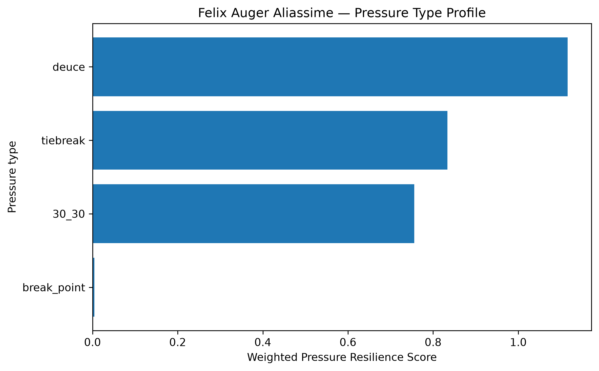
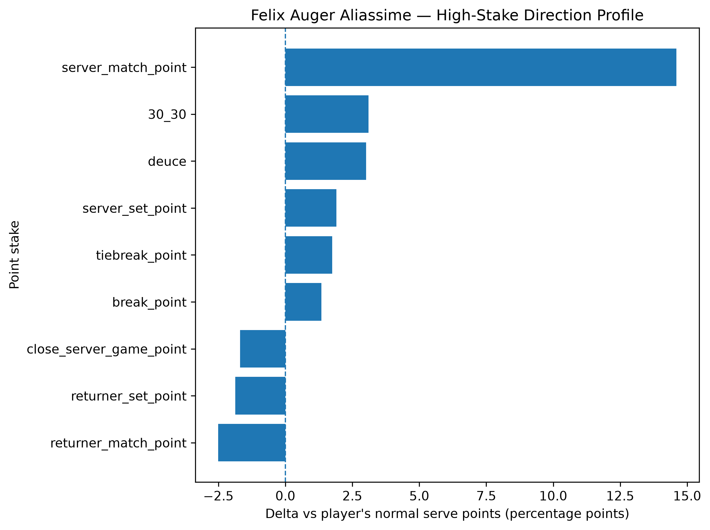
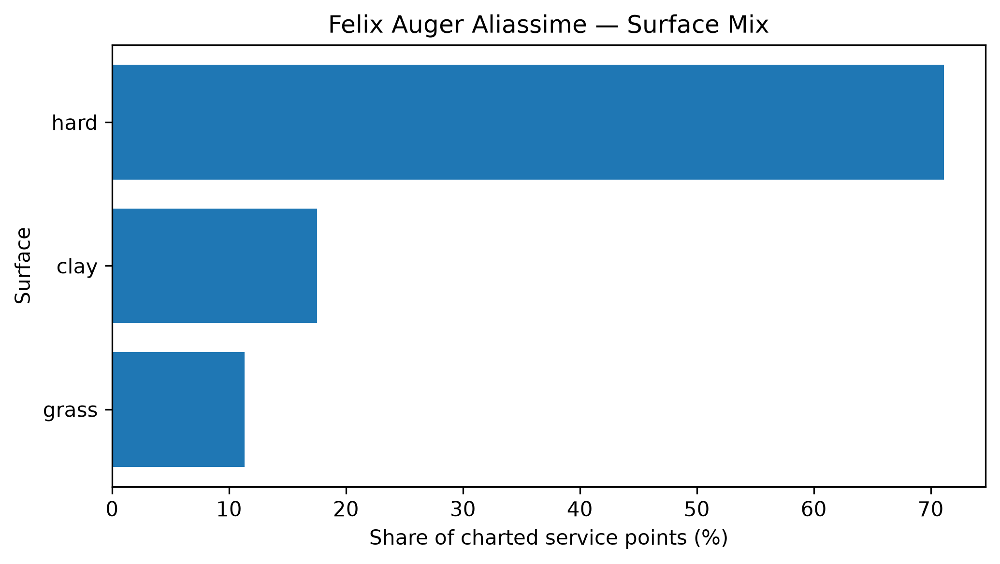

# Player Pressure Profile — Felix Auger Aliassime

## Overall

- **Weighted Pressure Resilience Score:** +0.91
- **Average reliability score:** 27.33
- **Charted matches:** 84
- **Effective pressure points:** 1681
- **Sample period:** 2020-01-07 to 2026-02-27
- **Normal weighted serve win rate:** 64.91%

## Interpretation

- Felix Auger Aliassime has a **positive pressure profile** in the final robust sample.
- His strongest pressure type is **deuce** with a score of **+1.12**.
- His weakest pressure type is **break_point** with a score of **+0.00**.
- Among high-stake situations, his best relative area is **server_match_point** (+14.60 percentage points vs normal).
- His weakest high-stake area is **returner_match_point** (-2.51 percentage points vs normal).
- His dominant surface exposure in the charted sample is **hard**.

## Pressure type profile

| pressure_type   |   raw_n_pressure |   effective_n_pressure |   rate_normal |   rate_pressure |   delta_pp |   weighted_pressure_resilience_score |   reliability_score |
|:----------------|-----------------:|-----------------------:|--------------:|----------------:|-----------:|-------------------------------------:|--------------------:|
| break_point     |              867 |                827.237 |      0.649079 |        0.662572 |    1.34932 |                           0.00421078 |            0.312067 |
| deuce           |              357 |                343.181 |      0.649079 |        0.679252 |    3.01731 |                           1.11602    |           36.9874   |
| 30_30           |              277 |                264.767 |      0.649079 |        0.680116 |    3.10373 |                           0.755924   |           24.3553   |
| tiebreak        |              260 |                245.665 |      0.649079 |        0.666567 |    1.74884 |                           0.83375    |           47.6745   |

## High-stake direction profile

| stake                   |   raw_points |   weighted_serve_win_rate |   delta_vs_player_normal_pp |
|:------------------------|-------------:|--------------------------:|----------------------------:|
| normal                  |         4370 |                  0.650166 |                     0.10874 |
| 30_30                   |          277 |                  0.680116 |                     3.10373 |
| deuce                   |          357 |                  0.679252 |                     3.01731 |
| break_point             |          867 |                  0.662572 |                     1.34932 |
| close_server_game_point |          437 |                  0.632213 |                    -1.68659 |
| server_set_point        |          102 |                  0.668144 |                     1.90659 |
| returner_set_point      |          128 |                  0.63035  |                    -1.87287 |
| server_match_point      |           35 |                  0.795056 |                    14.5978  |
| returner_match_point    |           58 |                  0.624011 |                    -2.5068  |
| tiebreak_point          |          260 |                  0.666567 |                     1.74884 |

## Surface mix

| surface_group   |   raw_points |   surface_share |   weighted_serve_win_rate |
|:----------------|-------------:|----------------:|--------------------------:|
| hard            |         4701 |        0.711303 |                  0.658572 |
| clay            |         1158 |        0.175216 |                  0.613705 |
| grass           |          750 |        0.113482 |                  0.691675 |

## Tournament exposure

| tournament_level   |   raw_points |      share |
|:-------------------|-------------:|-----------:|
| grand_slam         |         2419 | 0.366016   |
| masters_1000       |         1705 | 0.257982   |
| atp_500            |         1189 | 0.179906   |
| atp_250            |          653 | 0.0988047  |
| atp_finals         |          286 | 0.0432743  |
| other              |          168 | 0.0254199  |
| olympics           |          136 | 0.020578   |
| team_cup           |           53 | 0.00801937 |
