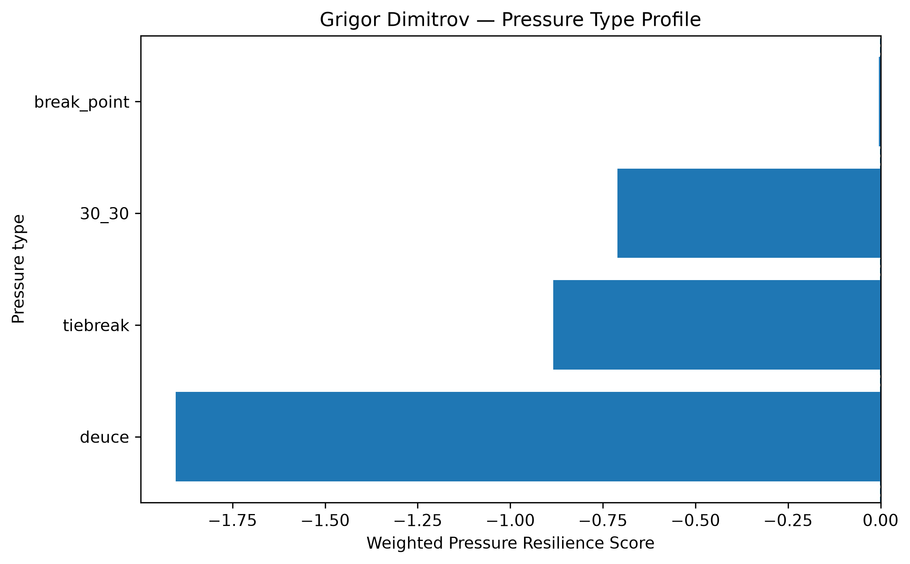
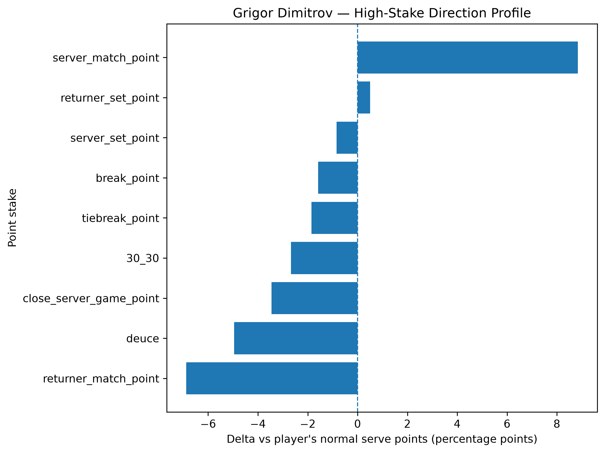
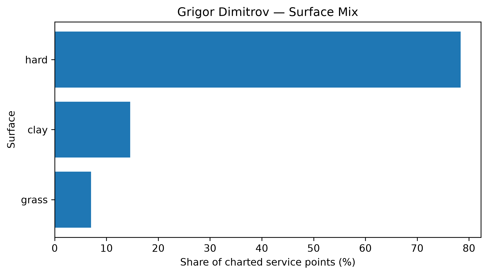

# Player Pressure Profile — Grigor Dimitrov

## Overall

- **Weighted Pressure Resilience Score:** -1.19
- **Average reliability score:** 28.26
- **Charted matches:** 95
- **Effective pressure points:** 1656
- **Sample period:** 2020-02-10 to 2026-03-07
- **Normal weighted serve win rate:** 66.77%

## Interpretation

- Grigor Dimitrov has a **negative pressure profile** in the final robust sample.
- His strongest pressure type is **break_point** with a score of **-0.00**.
- His weakest pressure type is **deuce** with a score of **-1.90**.
- Among high-stake situations, his best relative area is **server_match_point** (+8.84 percentage points vs normal).
- His weakest high-stake area is **returner_match_point** (-6.88 percentage points vs normal).
- His dominant surface exposure in the charted sample is **hard**.

## Pressure type profile

| pressure_type   |   raw_n_pressure |   effective_n_pressure |   rate_normal |   rate_pressure |   delta_pp |   weighted_pressure_resilience_score |   reliability_score |
|:----------------|-----------------:|-----------------------:|--------------:|----------------:|-----------:|-------------------------------------:|--------------------:|
| break_point     |              721 |                697.435 |      0.667712 |        0.651925 |   -1.57878 |                           -0.0042702 |            0.270474 |
| deuce           |              408 |                393.154 |      0.667712 |        0.618172 |   -4.95403 |                           -1.90303   |           38.4139   |
| 30_30           |              326 |                314.139 |      0.667712 |        0.640963 |   -2.67497 |                           -0.710057  |           26.5445   |
| tiebreak        |              261 |                251.422 |      0.667712 |        0.649212 |   -1.85006 |                           -0.884307  |           47.7988   |

## High-stake direction profile

| stake                   |   raw_points |   weighted_serve_win_rate |   delta_vs_player_normal_pp |
|:------------------------|-------------:|--------------------------:|----------------------------:|
| normal                  |         4728 |                  0.670815 |                    0.310276 |
| 30_30                   |          326 |                  0.640963 |                   -2.67497  |
| deuce                   |          408 |                  0.618172 |                   -4.95403  |
| break_point             |          721 |                  0.651925 |                   -1.57878  |
| close_server_game_point |          529 |                  0.633206 |                   -3.45065  |
| server_set_point        |          115 |                  0.659263 |                   -0.844909 |
| returner_set_point      |          126 |                  0.672703 |                    0.499047 |
| server_match_point      |           37 |                  0.756092 |                    8.83798  |
| returner_match_point    |           39 |                  0.598948 |                   -6.87639  |
| tiebreak_point          |          261 |                  0.649212 |                   -1.85006  |

## Surface mix

| surface_group   |   raw_points |   surface_share |   weighted_serve_win_rate |
|:----------------|-------------:|----------------:|--------------------------:|
| hard            |         5507 |       0.783915  |                  0.661541 |
| clay            |         1025 |       0.145907  |                  0.640674 |
| grass           |          493 |       0.0701779 |                  0.702862 |

## Tournament exposure

| tournament_level   |   raw_points |     share |
|:-------------------|-------------:|----------:|
| masters_1000       |         3260 | 0.464057  |
| grand_slam         |         1775 | 0.252669  |
| atp_500            |         1402 | 0.199573  |
| atp_250            |          424 | 0.0603559 |
| other              |          164 | 0.0233452 |
