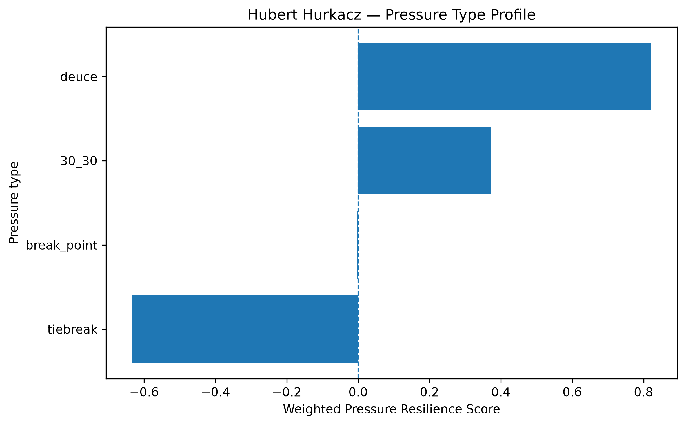
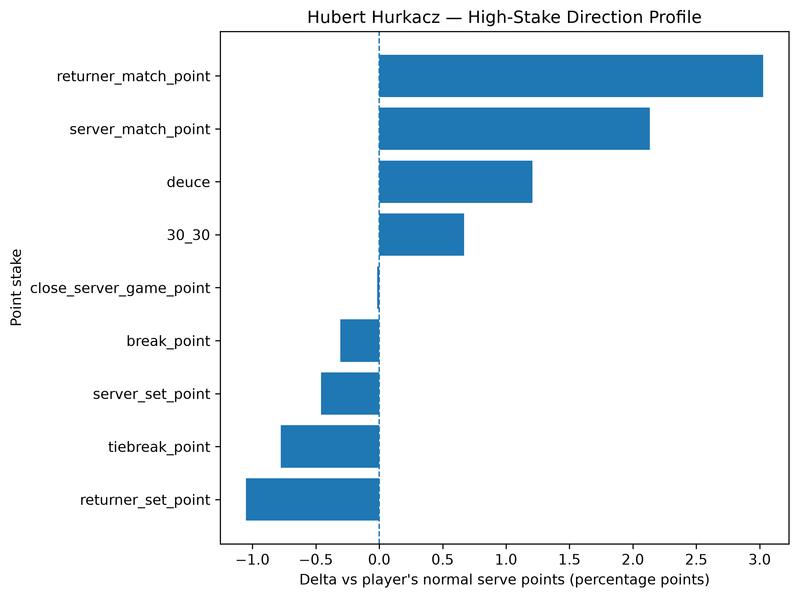
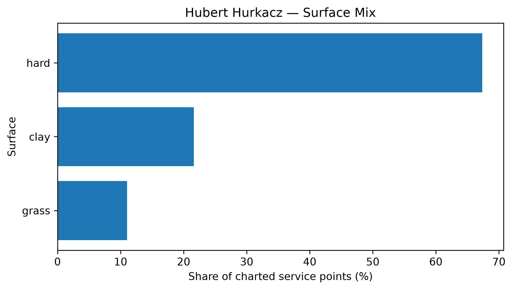

# Player Pressure Profile — Hubert Hurkacz

## Overall

- **Weighted Pressure Resilience Score:** +0.12
- **Average reliability score:** 51.45
- **Charted matches:** 281
- **Effective pressure points:** 5366
- **Sample period:** 2020-01-04 to 2026-04-22
- **Normal weighted serve win rate:** 68.58%

## Interpretation

- Hubert Hurkacz has a **near-neutral pressure profile** in the final robust sample.
- His strongest pressure type is **deuce** with a score of **+0.82**.
- His weakest pressure type is **tiebreak** with a score of **-0.63**.
- Among high-stake situations, his best relative area is **returner_match_point** (+3.03 percentage points vs normal).
- His weakest high-stake area is **returner_set_point** (-1.05 percentage points vs normal).
- His dominant surface exposure in the charted sample is **hard**.

## Pressure type profile

| pressure_type   |   raw_n_pressure |   effective_n_pressure |   rate_normal |   rate_pressure |   delta_pp |   weighted_pressure_resilience_score |   reliability_score |
|:----------------|-----------------:|-----------------------:|--------------:|----------------:|-----------:|-------------------------------------:|--------------------:|
| break_point     |             2074 |               1987.42  |      0.685766 |        0.682691 |  -0.307542 |                          -0.00251378 |            0.817377 |
| deuce           |             1248 |               1197.75  |      0.685766 |        0.697841 |   1.20744  |                           0.821836   |           68.0643   |
| 30_30           |             1040 |                996.631 |      0.685766 |        0.69247  |   0.6704   |                           0.371192   |           55.3688   |
| tiebreak        |             1231 |               1184.27  |      0.685766 |        0.677991 |  -0.777565 |                          -0.634064   |           81.5449   |

## High-stake direction profile

| stake                   |   raw_points |   weighted_serve_win_rate |   delta_vs_player_normal_pp |
|:------------------------|-------------:|--------------------------:|----------------------------:|
| normal                  |        16214 |                  0.685372 |                  -0.0393846 |
| 30_30                   |         1040 |                  0.69247  |                   0.6704    |
| deuce                   |         1248 |                  0.697841 |                   1.20744   |
| break_point             |         2074 |                  0.682691 |                  -0.307542  |
| close_server_game_point |         1827 |                  0.685589 |                  -0.0176997 |
| server_set_point        |          410 |                  0.681182 |                  -0.458381  |
| returner_set_point      |          347 |                  0.675258 |                  -1.05077   |
| server_match_point      |          168 |                  0.70709  |                   2.13238   |
| returner_match_point    |           96 |                  0.716028 |                   3.02615   |
| tiebreak_point          |         1231 |                  0.677991 |                  -0.777565  |

## Surface mix

| surface_group   |   raw_points |   surface_share |   weighted_serve_win_rate |
|:----------------|-------------:|----------------:|--------------------------:|
| hard            |        16041 |        0.673567 |                  0.688553 |
| clay            |         5150 |        0.21625  |                  0.667839 |
| grass           |         2624 |        0.110183 |                  0.706691 |

## Tournament exposure

| tournament_level   |   raw_points |     share |
|:-------------------|-------------:|----------:|
| masters_1000       |         8687 | 0.36477   |
| grand_slam         |         5205 | 0.21856   |
| atp_500            |         4544 | 0.190804  |
| atp_250            |         2875 | 0.120722  |
| team_cup           |         1985 | 0.0833508 |
| atp_finals         |          278 | 0.0116733 |
| other              |          241 | 0.0101197 |
