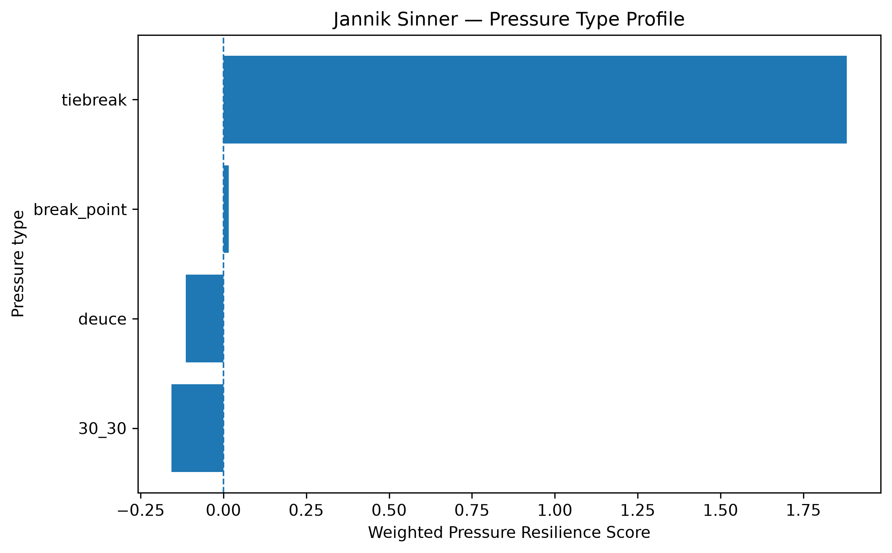
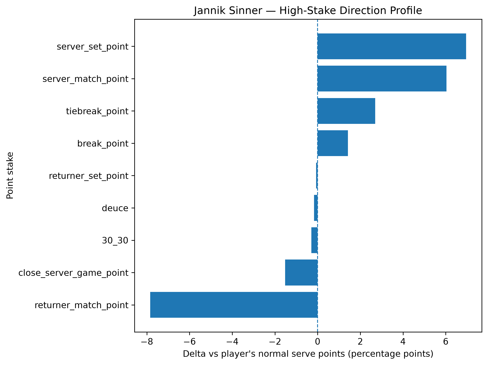
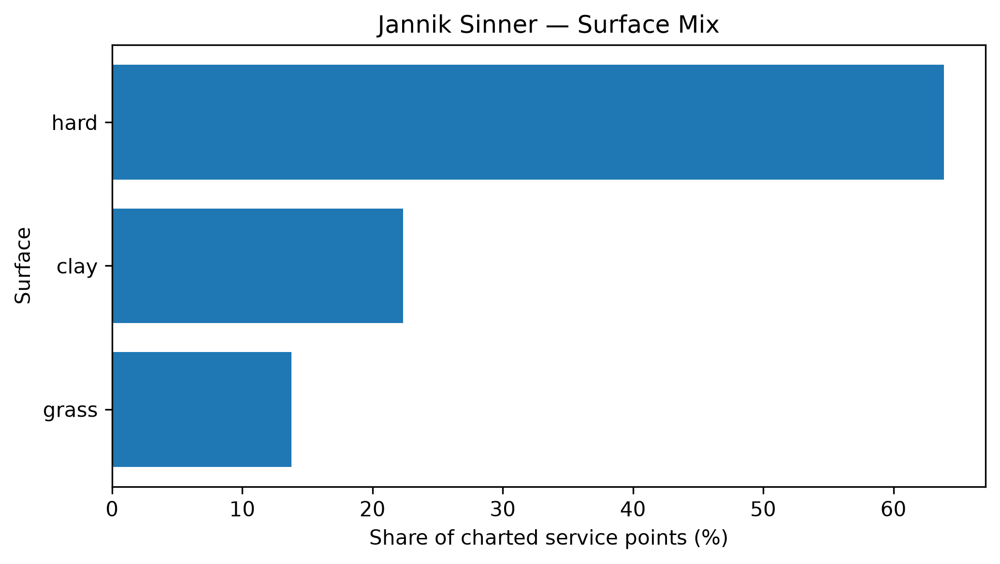

# Player Pressure Profile — Jannik Sinner

## Overall

- **Weighted Pressure Resilience Score:** +0.60
- **Average reliability score:** 47.71
- **Charted matches:** 279
- **Effective pressure points:** 5456
- **Sample period:** 2020-01-13 to 2026-05-17
- **Normal weighted serve win rate:** 68.31%

## Interpretation

- Jannik Sinner has a **positive pressure profile** in the final robust sample.
- His strongest pressure type is **tiebreak** with a score of **+1.88**.
- His weakest pressure type is **30_30** with a score of **-0.16**.
- Among high-stake situations, his best relative area is **server_set_point** (+6.95 percentage points vs normal).
- His weakest high-stake area is **returner_match_point** (-7.84 percentage points vs normal).
- His dominant surface exposure in the charted sample is **hard**.

## Pressure type profile

| pressure_type   |   raw_n_pressure |   effective_n_pressure |   rate_normal |   rate_pressure |   delta_pp |   weighted_pressure_resilience_score |   reliability_score |
|:----------------|-----------------:|-----------------------:|--------------:|----------------:|-----------:|-------------------------------------:|--------------------:|
| break_point     |             2885 |               2771.97  |      0.683051 |        0.697286 |   1.42354  |                             0.015631 |             1.09803 |
| deuce           |             1251 |               1204.89  |      0.683051 |        0.681363 |  -0.168749 |                            -0.113754 |            67.4104  |
| 30_30           |              950 |                914.348 |      0.683051 |        0.68008  |  -0.297094 |                            -0.156507 |            52.6791  |
| tiebreak        |              587 |                564.297 |      0.683051 |        0.710064 |   2.70133  |                             1.88141  |            69.6476  |

## High-stake direction profile

| stake                   |   raw_points |   weighted_serve_win_rate |   delta_vs_player_normal_pp |
|:------------------------|-------------:|--------------------------:|----------------------------:|
| normal                  |        14517 |                  0.683589 |                   0.0537919 |
| 30_30                   |          950 |                  0.68008  |                  -0.297094  |
| deuce                   |         1251 |                  0.681363 |                  -0.168749  |
| break_point             |         2885 |                  0.697286 |                   1.42354   |
| close_server_game_point |         1458 |                  0.667802 |                  -1.52489   |
| server_set_point        |          342 |                  0.752551 |                   6.94997   |
| returner_set_point      |          319 |                  0.682323 |                  -0.0728089 |
| server_match_point      |          145 |                  0.743368 |                   6.0317    |
| returner_match_point    |           40 |                  0.60467  |                  -7.83805   |
| tiebreak_point          |          587 |                  0.710064 |                   2.70133   |

## Surface mix

| surface_group   |   raw_points |   surface_share |   weighted_serve_win_rate |
|:----------------|-------------:|----------------:|--------------------------:|
| hard            |        13939 |        0.638759 |                  0.685649 |
| clay            |         4879 |        0.223582 |                  0.669141 |
| grass           |         3004 |        0.137659 |                  0.709522 |

## Tournament exposure

| tournament_level   |   raw_points |      share |
|:-------------------|-------------:|-----------:|
| grand_slam         |         9768 | 0.447622   |
| masters_1000       |         6337 | 0.290395   |
| atp_500            |         2893 | 0.132573   |
| atp_250            |         1152 | 0.0527908  |
| atp_finals         |          991 | 0.0454129  |
| davis_cup_finals   |          463 | 0.0212171  |
| other              |          128 | 0.00586564 |
| team_cup           |           90 | 0.00412428 |
