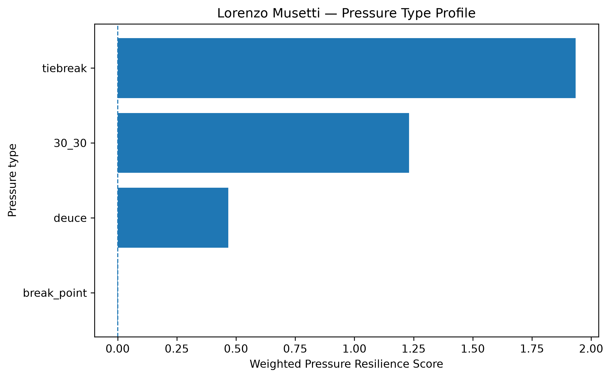
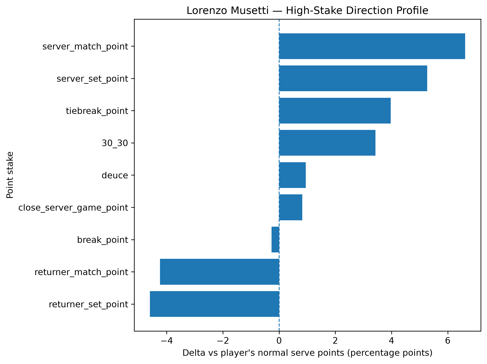
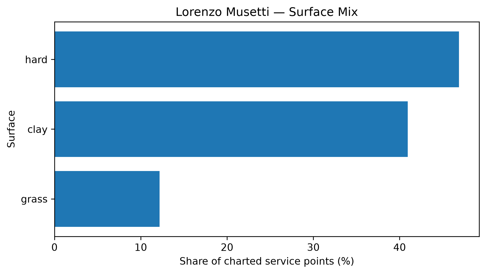

# Player Pressure Profile — Lorenzo Musetti

## Overall

- **Weighted Pressure Resilience Score:** +1.20
- **Average reliability score:** 33.57
- **Charted matches:** 122
- **Effective pressure points:** 2732
- **Sample period:** 2020-01-18 to 2026-04-17
- **Normal weighted serve win rate:** 62.41%

## Interpretation

- Lorenzo Musetti has a **positive pressure profile** in the final robust sample.
- His strongest pressure type is **tiebreak** with a score of **+1.93**.
- His weakest pressure type is **break_point** with a score of **-0.00**.
- Among high-stake situations, his best relative area is **server_match_point** (+6.62 percentage points vs normal).
- His weakest high-stake area is **returner_set_point** (-4.59 percentage points vs normal).
- His dominant surface exposure in the charted sample is **hard**.

## Pressure type profile

| pressure_type   |   raw_n_pressure |   effective_n_pressure |   rate_normal |   rate_pressure |   delta_pp |   weighted_pressure_resilience_score |   reliability_score |
|:----------------|-----------------:|-----------------------:|--------------:|----------------:|-----------:|-------------------------------------:|--------------------:|
| break_point     |             1458 |               1384.54  |      0.624118 |        0.621417 |  -0.270152 |                            -0.001312 |            0.485653 |
| deuce           |              641 |                609.867 |      0.624118 |        0.633625 |   0.950736 |                             0.467153 |           49.136    |
| 30_30           |              511 |                483.529 |      0.624118 |        0.658375 |   3.42571  |                             1.23063  |           35.9233   |
| tiebreak        |              271 |                253.998 |      0.624118 |        0.663795 |   3.96766  |                             1.93429  |           48.7513   |

## High-stake direction profile

| stake                   |   raw_points |   weighted_serve_win_rate |   delta_vs_player_normal_pp |
|:------------------------|-------------:|--------------------------:|----------------------------:|
| normal                  |         6364 |                  0.622925 |                   -0.1193   |
| 30_30                   |          511 |                  0.658375 |                    3.42571  |
| deuce                   |          641 |                  0.633625 |                    0.950736 |
| break_point             |         1458 |                  0.621417 |                   -0.270152 |
| close_server_game_point |          672 |                  0.632362 |                    0.824358 |
| server_set_point        |          109 |                  0.676817 |                    5.26989  |
| returner_set_point      |          202 |                  0.578178 |                   -4.59396  |
| server_match_point      |           44 |                  0.690279 |                    6.61614  |
| returner_match_point    |           50 |                  0.581769 |                   -4.23492  |
| tiebreak_point          |          271 |                  0.663795 |                    3.96766  |

## Surface mix

| surface_group   |   raw_points |   surface_share |   weighted_serve_win_rate |
|:----------------|-------------:|----------------:|--------------------------:|
| hard            |         4669 |        0.468775 |                  0.631621 |
| clay            |         4077 |        0.409337 |                  0.617266 |
| grass           |         1214 |        0.121888 |                  0.64267  |

## Tournament exposure

| tournament_level   |   raw_points |     share |
|:-------------------|-------------:|----------:|
| grand_slam         |         3378 | 0.339157  |
| masters_1000       |         2780 | 0.279116  |
| atp_500            |         1322 | 0.132731  |
| atp_250            |         1107 | 0.111145  |
| other              |          878 | 0.0881526 |
| atp_finals         |          232 | 0.0232932 |
| olympics           |          146 | 0.0146586 |
| challenger         |          117 | 0.011747  |
