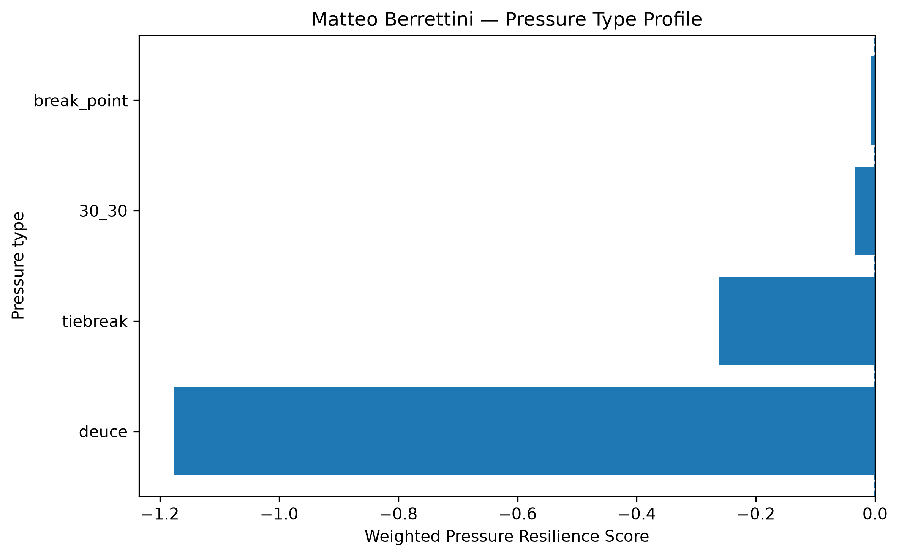
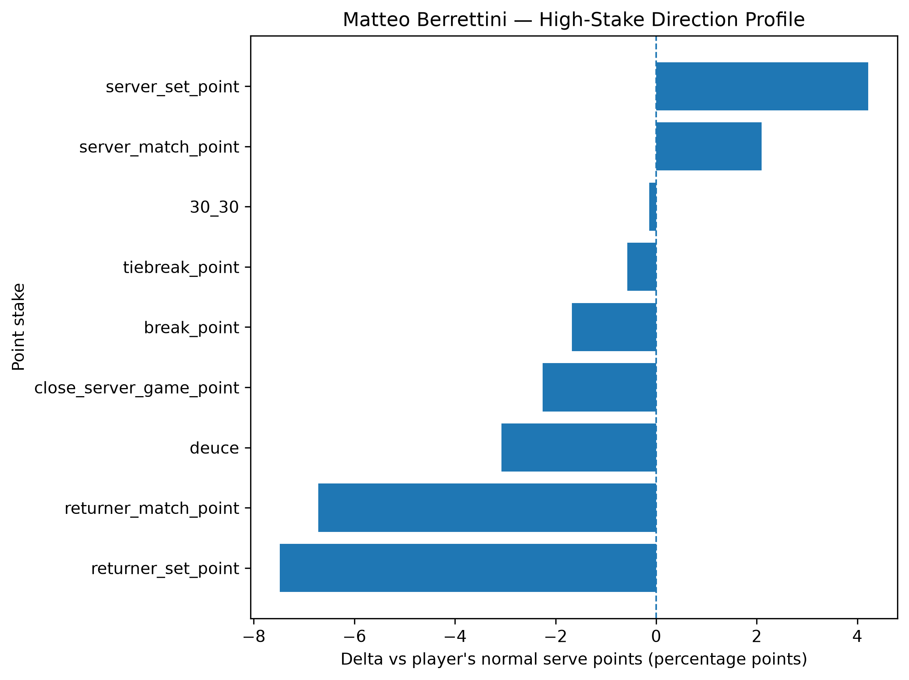
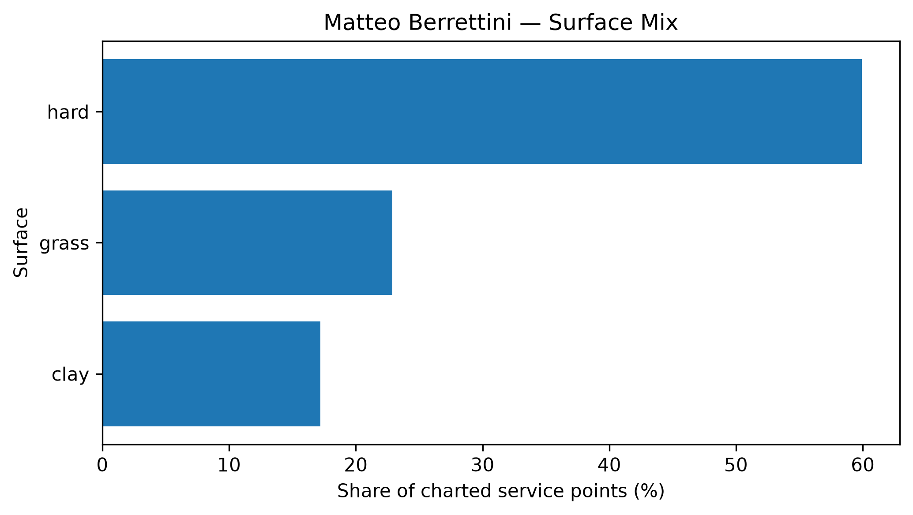

# Player Pressure Profile — Matteo Berrettini

## Overall

- **Weighted Pressure Resilience Score:** -0.53
- **Average reliability score:** 27.13
- **Charted matches:** 76
- **Effective pressure points:** 1995
- **Sample period:** 2020-01-22 to 2026-04-09
- **Normal weighted serve win rate:** 68.47%

## Interpretation

- Matteo Berrettini has a **negative pressure profile** in the final robust sample.
- His strongest pressure type is **break_point** with a score of **-0.01**.
- His weakest pressure type is **deuce** with a score of **-1.18**.
- Among high-stake situations, his best relative area is **server_set_point** (+4.21 percentage points vs normal).
- His weakest high-stake area is **returner_set_point** (-7.48 percentage points vs normal).
- His dominant surface exposure in the charted sample is **hard**.

## Pressure type profile

| pressure_type   |   raw_n_pressure |   effective_n_pressure |   rate_normal |   rate_pressure |   delta_pp |   weighted_pressure_resilience_score |   reliability_score |
|:----------------|-----------------:|-----------------------:|--------------:|----------------:|-----------:|-------------------------------------:|--------------------:|
| break_point     |             1196 |               1130.81  |      0.684713 |        0.667986 |  -1.67275  |                          -0.00669052 |             0.39997 |
| deuce           |              399 |                380.259 |      0.684713 |        0.653957 |  -3.07564  |                          -1.17665    |            38.257   |
| 30_30           |              276 |                261.308 |      0.684713 |        0.683345 |  -0.136816 |                          -0.0330322  |            24.1436  |
| tiebreak        |              235 |                222.467 |      0.684713 |        0.678977 |  -0.573654 |                          -0.262158   |            45.6997  |

## High-stake direction profile

| stake                   |   raw_points |   weighted_serve_win_rate |   delta_vs_player_normal_pp |
|:------------------------|-------------:|--------------------------:|----------------------------:|
| normal                  |         3978 |                  0.686043 |                    0.132997 |
| 30_30                   |          276 |                  0.683345 |                   -0.136816 |
| deuce                   |          399 |                  0.653957 |                   -3.07564  |
| break_point             |         1196 |                  0.667986 |                   -1.67275  |
| close_server_game_point |          314 |                  0.662171 |                   -2.25424  |
| server_set_point        |           61 |                  0.726839 |                    4.21255  |
| returner_set_point      |          174 |                  0.609903 |                   -7.48099  |
| server_match_point      |           18 |                  0.705666 |                    2.09527  |
| returner_match_point    |           41 |                  0.617504 |                   -6.72095  |
| tiebreak_point          |          235 |                  0.678977 |                   -0.573654 |

## Surface mix

| surface_group   |   raw_points |   surface_share |   weighted_serve_win_rate |
|:----------------|-------------:|----------------:|--------------------------:|
| hard            |         3844 |        0.599221 |                  0.68275  |
| clay            |         1104 |        0.172097 |                  0.661797 |
| grass           |         1467 |        0.228683 |                  0.682431 |

## Tournament exposure

| tournament_level   |   raw_points |     share |
|:-------------------|-------------:|----------:|
| grand_slam         |         2949 | 0.459704  |
| masters_1000       |         1411 | 0.219953  |
| atp_500            |          701 | 0.109275  |
| atp_250            |          539 | 0.0840218 |
| team_cup           |          346 | 0.0539361 |
| davis_cup          |          154 | 0.0240062 |
| other              |          143 | 0.0222915 |
| davis_cup_finals   |          104 | 0.016212  |
| atp_finals         |           68 | 0.0106002 |
