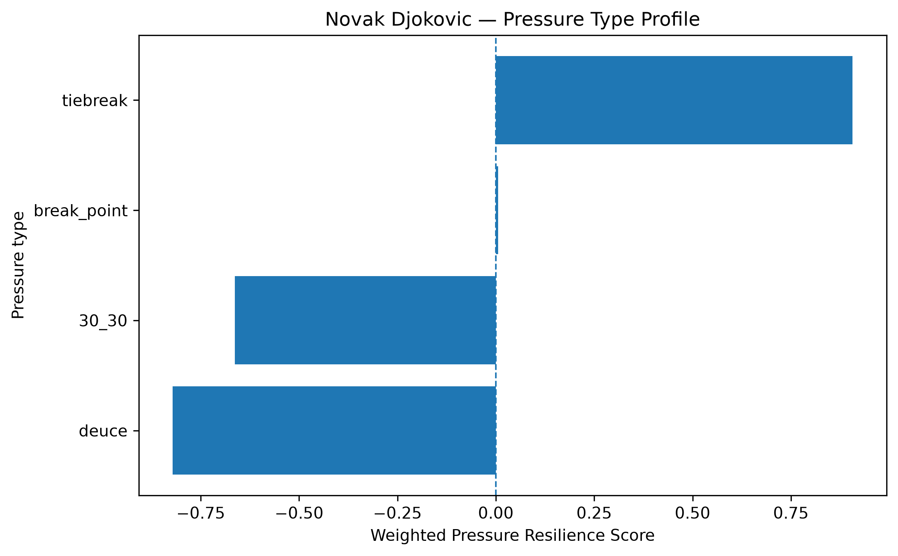
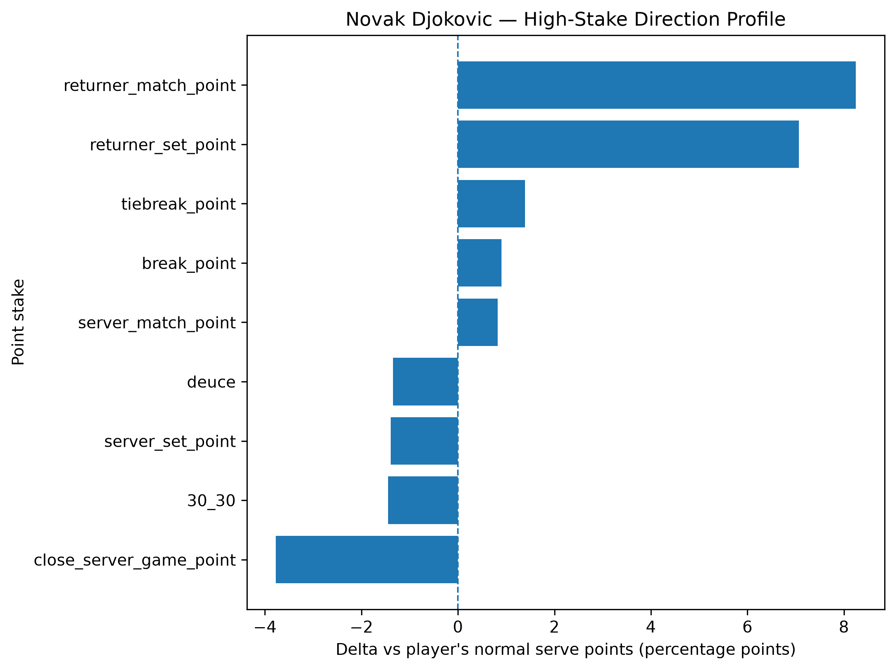
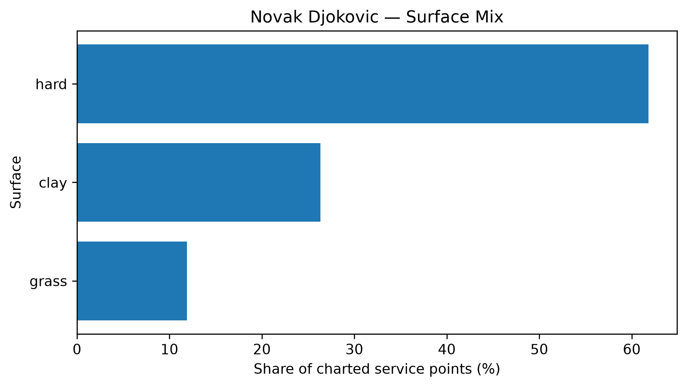

# Player Pressure Profile — Novak Djokovic

## Overall

- **Weighted Pressure Resilience Score:** -0.12
- **Average reliability score:** 43.17
- **Charted matches:** 197
- **Effective pressure points:** 3546
- **Sample period:** 2020-01-11 to 2026-03-11
- **Normal weighted serve win rate:** 68.41%

## Interpretation

- Novak Djokovic has a **near-neutral pressure profile** in the final robust sample.
- His strongest pressure type is **tiebreak** with a score of **+0.91**.
- His weakest pressure type is **deuce** with a score of **-0.82**.
- Among high-stake situations, his best relative area is **returner_match_point** (+8.24 percentage points vs normal).
- His weakest high-stake area is **close_server_game_point** (-3.77 percentage points vs normal).
- His dominant surface exposure in the charted sample is **hard**.

## Pressure type profile

| pressure_type   |   raw_n_pressure |   effective_n_pressure |   rate_normal |   rate_pressure |   delta_pp |   weighted_pressure_resilience_score |   reliability_score |
|:----------------|-----------------:|-----------------------:|--------------:|----------------:|-----------:|-------------------------------------:|--------------------:|
| break_point     |             1507 |               1441.89  |      0.684101 |        0.693132 |   0.903123 |                           0.00543465 |            0.601762 |
| deuce           |              963 |                926.621 |      0.684101 |        0.670651 |  -1.34502  |                          -0.821305   |           61.0625   |
| 30_30           |              738 |                707.423 |      0.684101 |        0.669645 |  -1.4456   |                          -0.663653   |           45.9085   |
| tiebreak        |              494 |                470.41  |      0.684101 |        0.698028 |   1.39268  |                           0.906751   |           65.1085   |

## High-stake direction profile

| stake                   |   raw_points |   weighted_serve_win_rate |   delta_vs_player_normal_pp |
|:------------------------|-------------:|--------------------------:|----------------------------:|
| normal                  |        11272 |                  0.688769 |                    0.466818 |
| 30_30                   |          738 |                  0.669645 |                   -1.4456   |
| deuce                   |          963 |                  0.670651 |                   -1.34502  |
| break_point             |         1507 |                  0.693132 |                    0.903123 |
| close_server_game_point |         1317 |                  0.646366 |                   -3.7735   |
| server_set_point        |          346 |                  0.670161 |                   -1.39399  |
| returner_set_point      |          172 |                  0.754766 |                    7.06645  |
| server_match_point      |          130 |                  0.692352 |                    0.825127 |
| returner_match_point    |           38 |                  0.766532 |                    8.24304  |
| tiebreak_point          |          494 |                  0.698028 |                    1.39268  |

## Surface mix

| surface_group   |   raw_points |   surface_share |   weighted_serve_win_rate |
|:----------------|-------------:|----------------:|--------------------------:|
| hard            |        10167 |        0.618055 |                  0.690996 |
| clay            |         4328 |        0.2631   |                  0.659634 |
| grass           |         1955 |        0.118845 |                  0.698791 |

## Tournament exposure

| tournament_level   |   raw_points |      share |
|:-------------------|-------------:|-----------:|
| grand_slam         |         9184 | 0.558298   |
| masters_1000       |         3442 | 0.20924    |
| atp_finals         |         1065 | 0.0647416  |
| atp_250            |          918 | 0.0558055  |
| olympics           |          619 | 0.0376292  |
| other              |          527 | 0.0320365  |
| atp_500            |          313 | 0.0190274  |
| team_cup           |          305 | 0.018541   |
| davis_cup_finals   |           77 | 0.00468085 |
