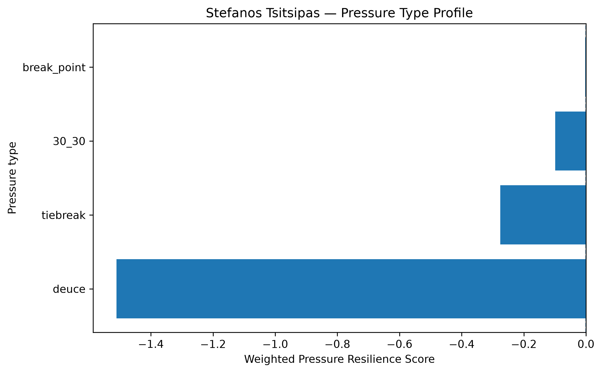
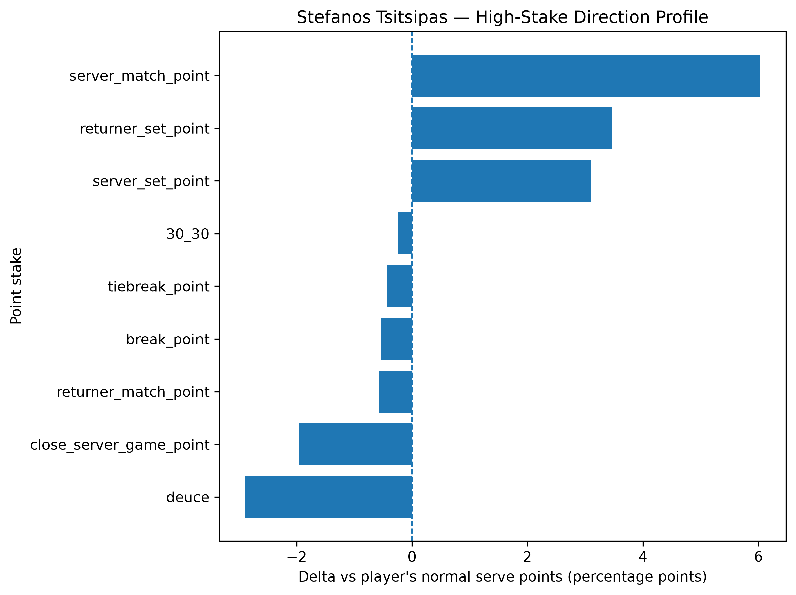
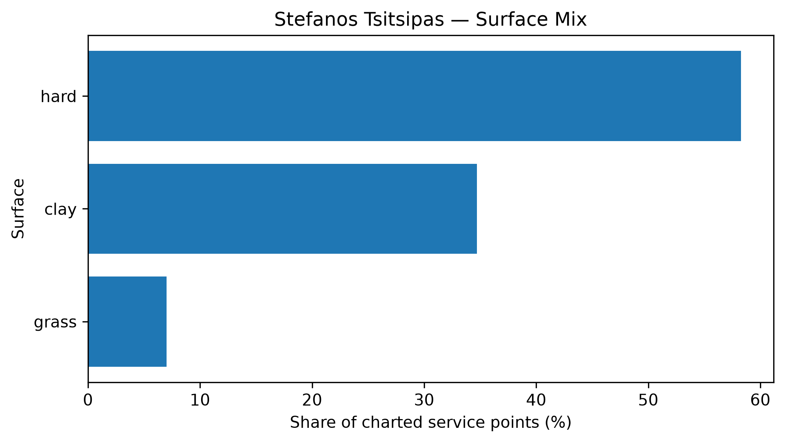

# Player Pressure Profile — Stefanos Tsitsipas

## Overall

- **Weighted Pressure Resilience Score:** -0.65
- **Average reliability score:** 38.91
- **Charted matches:** 153
- **Effective pressure points:** 2807
- **Sample period:** 2020-01-03 to 2026-05-07
- **Normal weighted serve win rate:** 67.35%

## Interpretation

- Stefanos Tsitsipas has a **negative pressure profile** in the final robust sample.
- His strongest pressure type is **break_point** with a score of **-0.00**.
- His weakest pressure type is **deuce** with a score of **-1.51**.
- Among high-stake situations, his best relative area is **server_match_point** (+6.03 percentage points vs normal).
- His weakest high-stake area is **deuce** (-2.89 percentage points vs normal).
- His dominant surface exposure in the charted sample is **hard**.

## Pressure type profile

| pressure_type   |   raw_n_pressure |   effective_n_pressure |   rate_normal |   rate_pressure |   delta_pp |   weighted_pressure_resilience_score |   reliability_score |
|:----------------|-----------------:|-----------------------:|--------------:|----------------:|-----------:|-------------------------------------:|--------------------:|
| break_point     |             1189 |               1133.46  |      0.673504 |        0.668158 |  -0.53464  |                           -0.002428  |            0.454138 |
| deuce           |              701 |                666.698 |      0.673504 |        0.644579 |  -2.89257  |                           -1.51083   |           52.2313   |
| 30_30           |              562 |                535.818 |      0.673504 |        0.670982 |  -0.252254 |                           -0.0987875 |           39.1619   |
| tiebreak        |              497 |                470.94  |      0.673504 |        0.669176 |  -0.432828 |                           -0.276036  |           63.775    |

## High-stake direction profile

| stake                   |   raw_points |   weighted_serve_win_rate |   delta_vs_player_normal_pp |
|:------------------------|-------------:|--------------------------:|----------------------------:|
| normal                  |         8705 |                  0.675644 |                    0.213973 |
| 30_30                   |          562 |                  0.670982 |                   -0.252254 |
| deuce                   |          701 |                  0.644579 |                   -2.89257  |
| break_point             |         1189 |                  0.668158 |                   -0.53464  |
| close_server_game_point |          989 |                  0.65393  |                   -1.95748  |
| server_set_point        |          196 |                  0.704538 |                    3.10337  |
| returner_set_point      |          199 |                  0.708186 |                    3.46816  |
| server_match_point      |           69 |                  0.733805 |                    6.03003  |
| returner_match_point    |           86 |                  0.667767 |                   -0.573782 |
| tiebreak_point          |          497 |                  0.669176 |                   -0.432828 |

## Surface mix

| surface_group   |   raw_points |   surface_share |   weighted_serve_win_rate |
|:----------------|-------------:|----------------:|--------------------------:|
| hard            |         7421 |       0.582725  |                  0.678601 |
| clay            |         4421 |       0.347154  |                  0.652017 |
| grass           |          893 |       0.0701217 |                  0.709211 |

## Tournament exposure

| tournament_level   |   raw_points |      share |
|:-------------------|-------------:|-----------:|
| grand_slam         |         4528 | 0.355556   |
| masters_1000       |         4084 | 0.320691   |
| atp_500            |         2064 | 0.162073   |
| atp_250            |          934 | 0.0733412  |
| team_cup           |          503 | 0.0394974  |
| atp_finals         |          371 | 0.0291323  |
| olympics           |          130 | 0.0102081  |
| other              |          121 | 0.00950137 |
