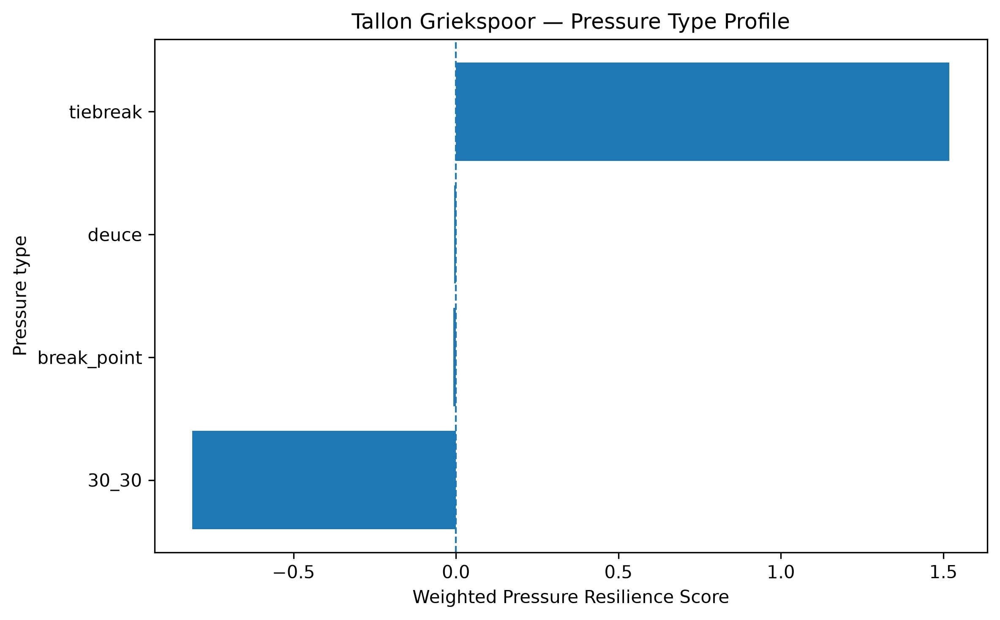
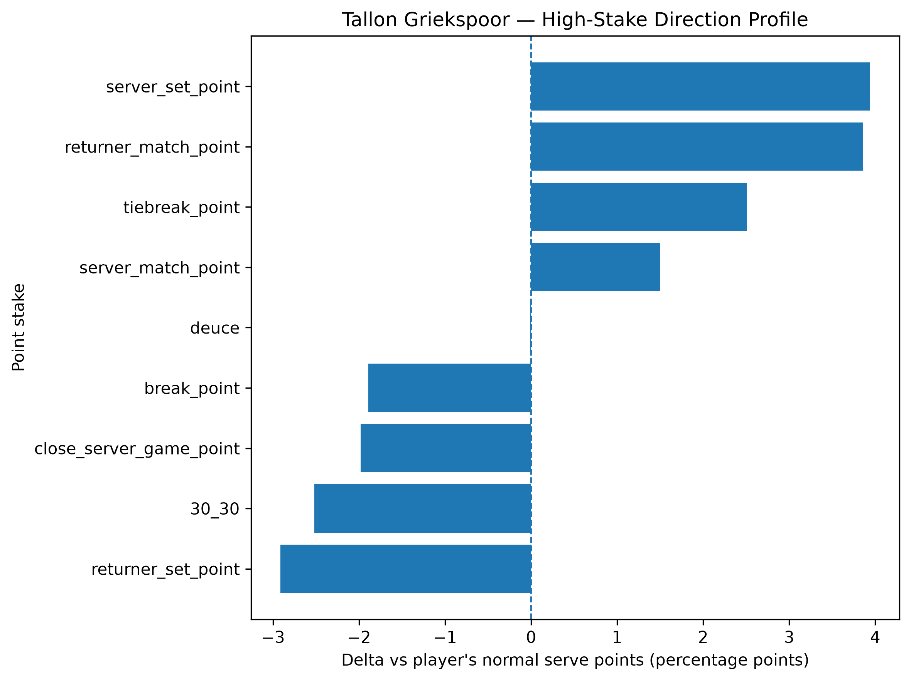
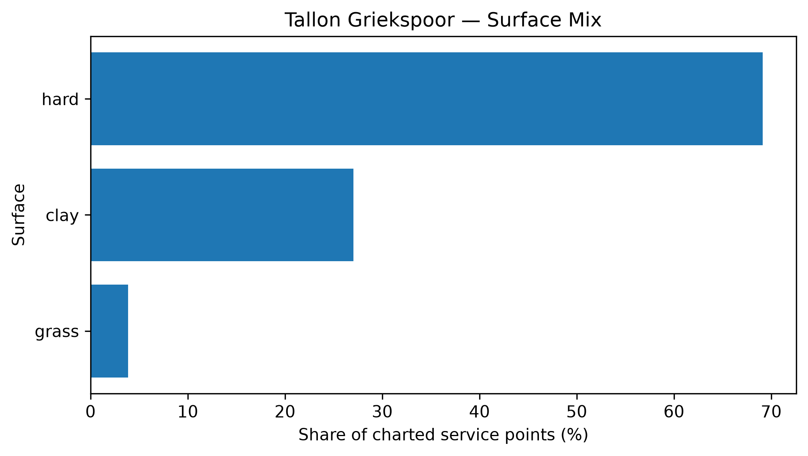

# Player Pressure Profile — Tallon Griekspoor

## Overall

- **Weighted Pressure Resilience Score:** +0.46
- **Average reliability score:** 35.52
- **Charted matches:** 109
- **Effective pressure points:** 2601
- **Sample period:** 2020-01-18 to 2026-04-05
- **Normal weighted serve win rate:** 65.40%

## Interpretation

- Tallon Griekspoor has a **near-neutral pressure profile** in the final robust sample.
- His strongest pressure type is **tiebreak** with a score of **+1.52**.
- His weakest pressure type is **30_30** with a score of **-0.81**.
- Among high-stake situations, his best relative area is **server_set_point** (+3.94 percentage points vs normal).
- His weakest high-stake area is **returner_set_point** (-2.91 percentage points vs normal).
- His dominant surface exposure in the charted sample is **hard**.

## Pressure type profile

| pressure_type   |   raw_n_pressure |   effective_n_pressure |   rate_normal |   rate_pressure |   delta_pp |   weighted_pressure_resilience_score |   reliability_score |
|:----------------|-----------------:|-----------------------:|--------------:|----------------:|-----------:|-------------------------------------:|--------------------:|
| break_point     |             1248 |               1180.6   |      0.654017 |        0.635091 | -1.89257   |                          -0.00812716 |            0.429425 |
| deuce           |              623 |                588.152 |      0.654017 |        0.653895 | -0.0122202 |                          -0.00597    |           48.8535   |
| 30_30           |              446 |                420.321 |      0.654017 |        0.628803 | -2.52144   |                          -0.811454   |           32.1822   |
| tiebreak        |              429 |                411.904 |      0.654017 |        0.679071 |  2.50544   |                           1.51872    |           60.617    |

## High-stake direction profile

| stake                   |   raw_points |   weighted_serve_win_rate |   delta_vs_player_normal_pp |
|:------------------------|-------------:|--------------------------:|----------------------------:|
| normal                  |         6002 |                  0.655675 |                   0.165801  |
| 30_30                   |          446 |                  0.628803 |                  -2.52144   |
| deuce                   |          623 |                  0.653895 |                  -0.0122202 |
| break_point             |         1248 |                  0.635091 |                  -1.89257   |
| close_server_game_point |          689 |                  0.634192 |                  -1.98252   |
| server_set_point        |          122 |                  0.693399 |                   3.9382    |
| returner_set_point      |          193 |                  0.624884 |                  -2.91329   |
| server_match_point      |           50 |                  0.669    |                   1.49829   |
| returner_match_point    |           62 |                  0.692573 |                   3.85558   |
| tiebreak_point          |          429 |                  0.679071 |                   2.50544   |

## Surface mix

| surface_group   |   raw_points |   surface_share |   weighted_serve_win_rate |
|:----------------|-------------:|----------------:|--------------------------:|
| hard            |         6494 |       0.691219  |                  0.654476 |
| clay            |         2540 |       0.270357  |                  0.63957  |
| grass           |          361 |       0.0384247 |                  0.662902 |

## Tournament exposure

| tournament_level   |   raw_points |      share |
|:-------------------|-------------:|-----------:|
| grand_slam         |         2260 | 0.238321   |
| masters_1000       |         1759 | 0.18549    |
| atp_500            |         1746 | 0.184119   |
| atp_250            |         1519 | 0.160181   |
| davis_cup          |          712 | 0.0750817  |
| challenger         |          615 | 0.0648529  |
| davis_cup_finals   |          531 | 0.0559949  |
| team_cup           |          154 | 0.0162396  |
| olympics           |          103 | 0.0108615  |
| other              |           84 | 0.00885796 |
