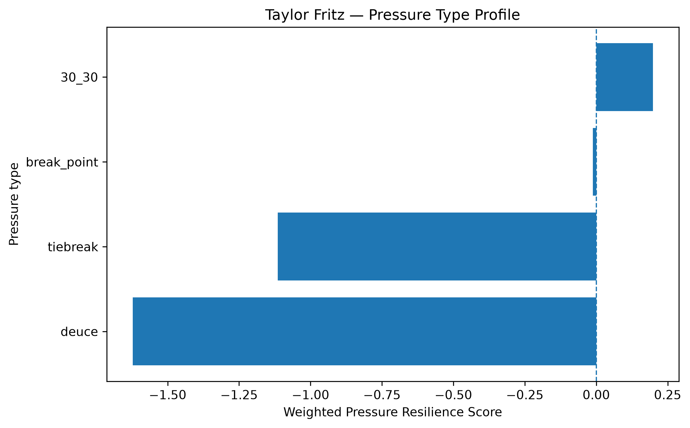
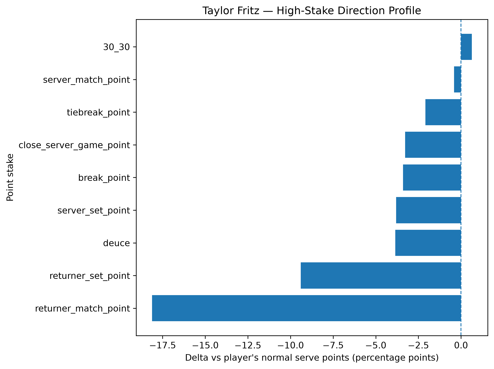
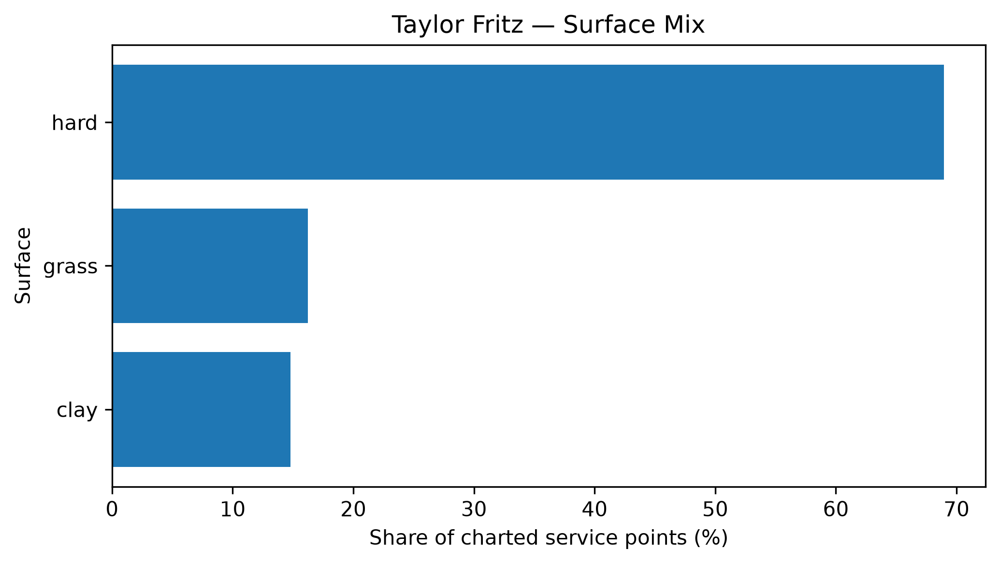

# Player Pressure Profile — Taylor Fritz

## Overall

- **Weighted Pressure Resilience Score:** -0.95
- **Average reliability score:** 31.82
- **Charted matches:** 113
- **Effective pressure points:** 1949
- **Sample period:** 2020-01-06 to 2026-01-26
- **Normal weighted serve win rate:** 69.48%

## Interpretation

- Taylor Fritz has a **negative pressure profile** in the final robust sample.
- His strongest pressure type is **30_30** with a score of **+0.20**.
- His weakest pressure type is **deuce** with a score of **-1.62**.
- Among high-stake situations, his best relative area is **30_30** (+0.63 percentage points vs normal).
- His weakest high-stake area is **returner_match_point** (-18.11 percentage points vs normal).
- His dominant surface exposure in the charted sample is **hard**.

## Pressure type profile

| pressure_type   |   raw_n_pressure |   effective_n_pressure |   rate_normal |   rate_pressure |   delta_pp |   weighted_pressure_resilience_score |   reliability_score |
|:----------------|-----------------:|-----------------------:|--------------:|----------------:|-----------:|-------------------------------------:|--------------------:|
| break_point     |              881 |                851.936 |      0.694822 |        0.660771 |  -3.4051   |                           -0.0115309 |            0.338635 |
| deuce           |              450 |                433.26  |      0.694822 |        0.656301 |  -3.85213  |                           -1.62239   |           42.1166   |
| 30_30           |              379 |                363.131 |      0.694822 |        0.701106 |   0.628365 |                            0.198264  |           31.5524   |
| tiebreak        |              314 |                300.681 |      0.694822 |        0.673902 |  -2.09203  |                           -1.11466   |           53.2812   |

## High-stake direction profile

| stake                   |   raw_points |   weighted_serve_win_rate |   delta_vs_player_normal_pp |
|:------------------------|-------------:|--------------------------:|----------------------------:|
| normal                  |         6369 |                  0.698356 |                    0.35334  |
| 30_30                   |          379 |                  0.701106 |                    0.628365 |
| deuce                   |          450 |                  0.656301 |                   -3.85213  |
| break_point             |          881 |                  0.660771 |                   -3.4051   |
| close_server_game_point |          647 |                  0.662012 |                   -3.28109  |
| server_set_point        |          140 |                  0.656736 |                   -3.80865  |
| returner_set_point      |          128 |                  0.60084  |                   -9.39825  |
| server_match_point      |           58 |                  0.690765 |                   -0.405729 |
| returner_match_point    |           42 |                  0.513683 |                  -18.1139   |
| tiebreak_point          |          314 |                  0.673902 |                   -2.09203  |

## Surface mix

| surface_group   |   raw_points |   surface_share |   weighted_serve_win_rate |
|:----------------|-------------:|----------------:|--------------------------:|
| hard            |         6276 |        0.689519 |                  0.685577 |
| clay            |         1347 |        0.147989 |                  0.667902 |
| grass           |         1479 |        0.162492 |                  0.722698 |

## Tournament exposure

| tournament_level   |   raw_points |      share |
|:-------------------|-------------:|-----------:|
| grand_slam         |         3720 | 0.408701   |
| masters_1000       |         2787 | 0.306196   |
| atp_250            |          744 | 0.0817403  |
| atp_finals         |          730 | 0.0802022  |
| atp_500            |          676 | 0.0742694  |
| team_cup           |          397 | 0.0436168  |
| other              |           48 | 0.00527357 |
