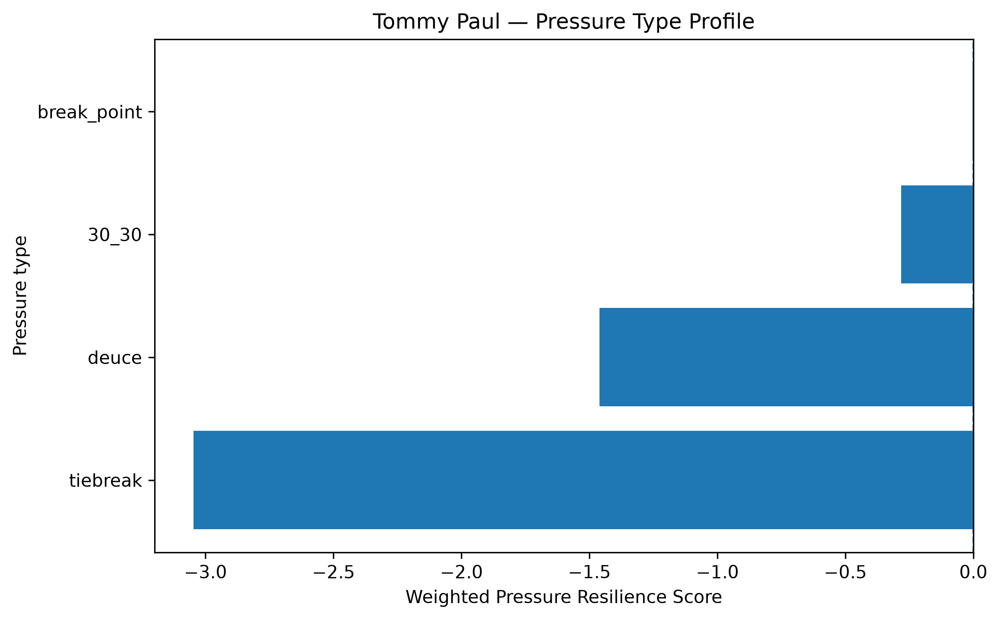
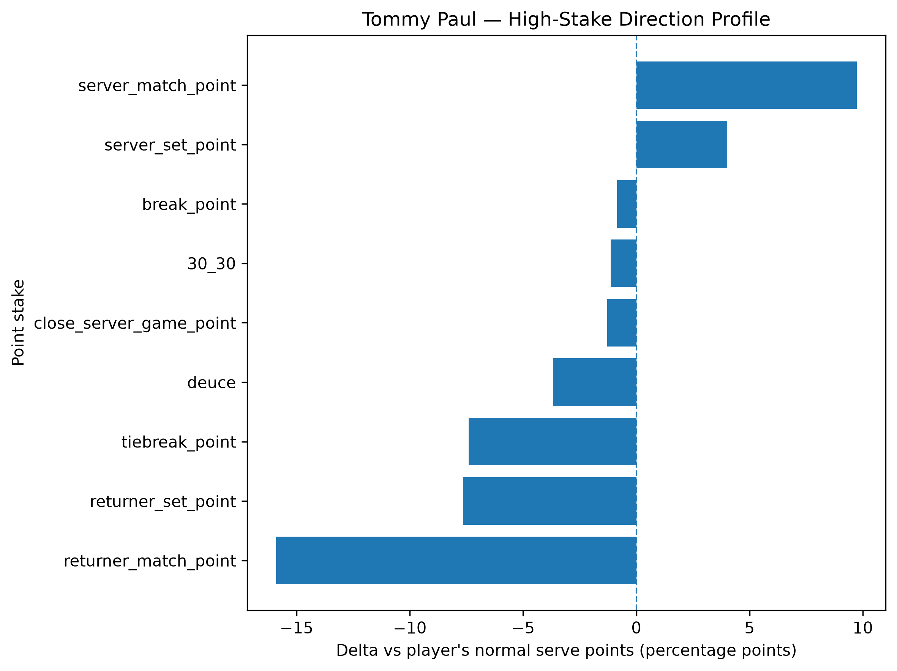
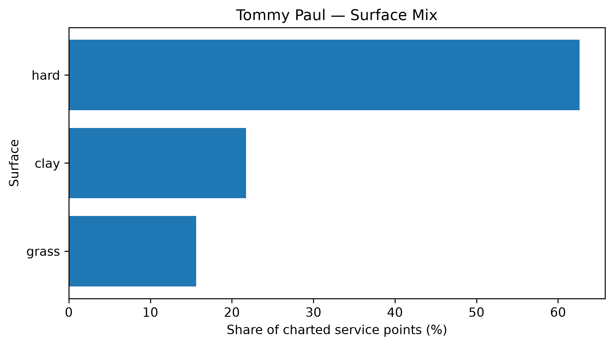

# Player Pressure Profile — Tommy Paul

## Overall

- **Weighted Pressure Resilience Score:** -1.80
- **Average reliability score:** 26.47
- **Charted matches:** 75
- **Effective pressure points:** 1782
- **Sample period:** 2020-01-17 to 2026-03-25
- **Normal weighted serve win rate:** 63.84%

## Interpretation

- Tommy Paul has a **negative pressure profile** in the final robust sample.
- His strongest pressure type is **break_point** with a score of **-0.00**.
- His weakest pressure type is **tiebreak** with a score of **-3.05**.
- Among high-stake situations, his best relative area is **server_match_point** (+9.72 percentage points vs normal).
- His weakest high-stake area is **returner_match_point** (-15.90 percentage points vs normal).
- His dominant surface exposure in the charted sample is **hard**.

## Pressure type profile

| pressure_type   |   raw_n_pressure |   effective_n_pressure |   rate_normal |   rate_pressure |   delta_pp |   weighted_pressure_resilience_score |   reliability_score |
|:----------------|-----------------:|-----------------------:|--------------:|----------------:|-----------:|-------------------------------------:|--------------------:|
| break_point     |              891 |                852.166 |      0.638447 |        0.630004 |  -0.844375 |                          -0.00257051 |            0.304428 |
| deuce           |              451 |                430.315 |      0.638447 |        0.601594 |  -3.68535  |                          -1.46154    |           39.658    |
| 30_30           |              308 |                293.547 |      0.638447 |        0.627094 |  -1.13538  |                          -0.28149    |           24.7926   |
| tiebreak        |              215 |                206.436 |      0.638447 |        0.564326 |  -7.41213  |                          -3.04721    |           41.1111   |

## High-stake direction profile

| stake                   |   raw_points |   weighted_serve_win_rate |   delta_vs_player_normal_pp |
|:------------------------|-------------:|--------------------------:|----------------------------:|
| normal                  |         3977 |                  0.638579 |                   0.0131546 |
| 30_30                   |          308 |                  0.627094 |                  -1.13538   |
| deuce                   |          451 |                  0.601594 |                  -3.68535   |
| break_point             |          891 |                  0.630004 |                  -0.844375  |
| close_server_game_point |          484 |                  0.625593 |                  -1.28541   |
| server_set_point        |          105 |                  0.678624 |                   4.01768   |
| returner_set_point      |          121 |                  0.562006 |                  -7.64419   |
| server_match_point      |           45 |                  0.735675 |                   9.72275   |
| returner_match_point    |           45 |                  0.479442 |                 -15.9005    |
| tiebreak_point          |          215 |                  0.564326 |                  -7.41213   |

## Surface mix

| surface_group   |   raw_points |   surface_share |   weighted_serve_win_rate |
|:----------------|-------------:|----------------:|--------------------------:|
| hard            |         3985 |        0.626375 |                  0.635866 |
| clay            |         1383 |        0.217384 |                  0.610145 |
| grass           |          994 |        0.15624  |                  0.646002 |

## Tournament exposure

| tournament_level   |   raw_points |      share |
|:-------------------|-------------:|-----------:|
| masters_1000       |         2259 | 0.355077   |
| grand_slam         |         2175 | 0.341874   |
| atp_250            |         1093 | 0.171801   |
| atp_500            |          652 | 0.102483   |
| challenger         |           72 | 0.0113172  |
| davis_cup_finals   |           68 | 0.0106885  |
| other              |           43 | 0.00675888 |
